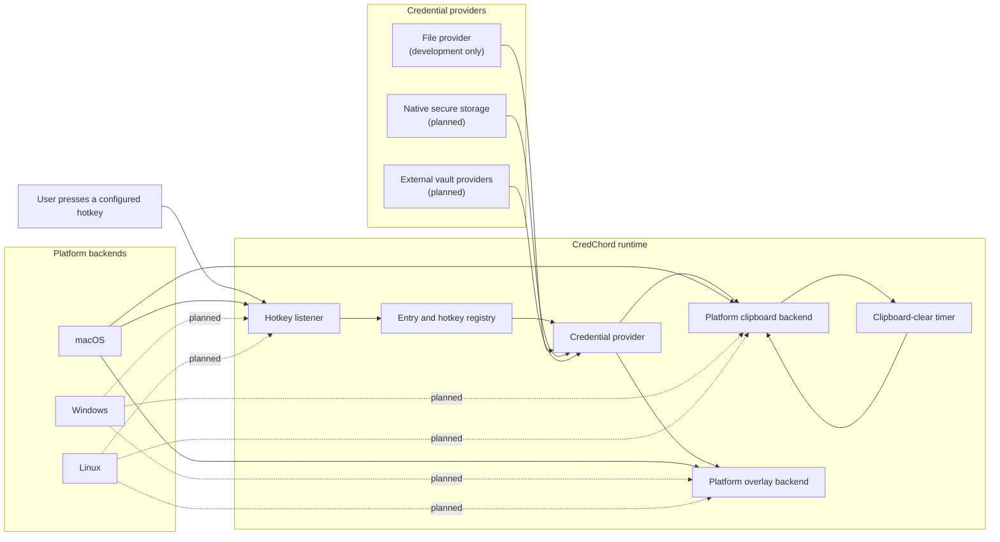
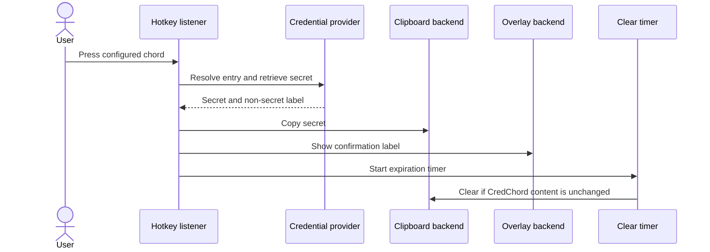

# CredChord

**Credentials at the press of a chord.**

CredChord is an open-source, cross-platform credential manager written in Rust. It maps global keyboard shortcuts to credential entries, copies the selected secret to the clipboard for a limited time, and displays a short-lived confirmation overlay **without showing the secret itself**.

> [!IMPORTANT]
> CredChord is currently an early-stage prototype. The existing file provider stores secrets in plaintext and should be used only for development and testing. Secure storage providers and a broader security review are required before production use.

## Why CredChord?

Traditional password managers often require opening a vault, searching for an entry, and selecting a copy action. CredChord is designed for credentials that are used repeatedly during a workflow:

1. Assign a global keyboard chord to an entry.
2. Run CredChord in listener mode.
3. Press the chord from any application.
4. CredChord retrieves the configured secret and copies it temporarily.
5. A non-secret confirmation appears on screen.
6. The clipboard is cleared after the configured timeout.

CredChord is **not** a clipboard-history manager. It does not exist to record everything copied by the user. Its purpose is deliberate, hotkey-triggered retrieval of configured credentials.

## How CredChord differs from other password managers

CredChord is not intended to replace every feature of a traditional password manager. Its primary goal is to provide the fastest possible access to frequently used credentials through dedicated global keyboard shortcuts.

| Password manager            | What makes it distinctive                                                                                                                                 | How CredChord differs                                                                                                                                                                                                                                         |
| --------------------------- | --------------------------------------------------------------------------------------------------------------------------------------------------------- | ------------------------------------------------------------------------------------------------------------------------------------------------------------------------------------------------------------------------------------------------------------- |
| **1Password**               | Polished personal, family, and enterprise vaults; strong browser autofill; Travel Mode; SSH-agent and developer integrations                              | 1Password is a complete cloud-backed vault platform. CredChord focuses on retrieving a specific credential immediately with a global keyboard chord, without opening or searching a vault.                                                                    |
| **Bitwarden**               | Open-source clients, optional self-hosting, broad platform support, organizations, collections, and secure sharing                                        | Bitwarden is a complete synchronized password vault. CredChord is a lightweight desktop access layer and could eventually use Bitwarden as a credential provider.                                                                                             |
| **Proton Pass**             | Privacy-focused password manager with passkeys and integrated hide-my-email aliases                                                                       | Proton Pass emphasizes identity privacy and the Proton ecosystem. CredChord emphasizes direct keyboard-driven retrieval across desktop applications.                                                                                                          |
| **Dashlane**                | Password health monitoring, phishing protection, credential-risk reporting, and dark-web monitoring                                                       | Dashlane expands beyond password storage into organizational risk detection. CredChord intentionally keeps a smaller, local, workflow-focused design.                                                                                                         |
| **Keeper**                  | Strong enterprise administration, BreachWatch, reporting, secrets management, and privileged-access features                                              | Keeper targets enterprise security governance and privileged access. CredChord targets fast individual access to frequently used credentials.                                                                                                                 |
| **NordPass**                | Straightforward interface, password health reports, breach scanning, passkeys, and encrypted sharing                                                      | NordPass follows the conventional vault-and-autofill model. CredChord provides direct hotkey-to-credential mappings without requiring vault navigation.                                                                                                       |
| **KeePassXC**               | Open-source, local encrypted database with no required hosted service                                                                                     | KeePassXC is the closest local-first comparison. It still centers on opening or searching a vault, while CredChord centers on immediate retrieval through a dedicated keyboard chord. A KeePass-compatible database could become a future CredChord provider. |
| **Apple Passwords**         | Deep integration with macOS, iOS, iCloud Keychain, passkeys, verification codes, and Apple autofill                                                       | Apple Passwords is tightly integrated into the Apple ecosystem. CredChord is designed to work consistently across macOS, Windows, and Linux.                                                                                                                  |
| **Google Password Manager** | Built directly into Chrome and Android with Google Account synchronization and password checks                                                            | Google Password Manager is browser- and Android-centered. CredChord operates at the desktop level and can retrieve credentials for terminals, native applications, remote sessions, and other non-browser workflows.                                          |
| **Enpass**                  | Offline vault storage with user-selected synchronization through cloud storage, folders, or local Wi-Fi                                                   | Enpass focuses on local vault ownership and synchronization. CredChord focuses on the fastest possible interaction with selected entries.                                                                                                                     |
| **CredChord**               | Dedicated global keyboard chords, temporary clipboard access, non-secret confirmation overlays, modular providers, and a cross-platform Rust architecture | CredChord is designed as a focused credential-access tool rather than a full browser-first password-management ecosystem.                                                                                                                                     |

### CredChord's primary differentiators

* **Direct hotkey-to-credential mapping:** A specific keyboard chord can retrieve a specific configured credential.
* **No vault search required:** Routine access does not require opening a window, typing a search, or selecting an entry.
* **Non-secret confirmation:** CredChord displays the entry label or confirmation message, never the password itself.
* **Temporary clipboard exposure:** Credentials are copied for a limited period and cleared only if the clipboard content has not changed.
* **System-wide workflow:** CredChord is designed for terminals, remote sessions, native applications, browsers, and other desktop workflows.
* **Cross-platform architecture:** The Rust core separates credential providers from macOS, Windows, and Linux platform backends.
* **Pluggable providers:** Future providers may include native operating-system credential stores, KeePass databases, Bitwarden, Azure Key Vault, HashiCorp Vault, and other secret-management systems.
* **Small and auditable:** CredChord aims to keep security-sensitive behavior modular and understandable.

> CredChord does not currently attempt to replace full password managers, browser autofill systems, team vaults, passkey platforms, or enterprise privileged-access products. It is designed to complement those systems by providing a fast, keyboard-driven desktop access layer.


## Current status

| Capability | macOS | Windows | Linux |
|---|---:|---:|---:|
| Global hotkeys | Working | Planned | Planned |
| Clipboard write and timed clear | Working | Planned | Planned |
| Transient confirmation overlay | Working | Planned | Planned |
| File-based provider | Working | Working core | Working core |
| Secure native storage provider | Planned | Planned | Planned |
| Packaged release | Planned | Planned | Planned |

Linux contributors are especially welcome. Initial Linux work will likely target X11 first, followed by Wayland implementations for major desktop environments and portals.
Contributions for integrations with established password managers and secret-management platforms are also welcome. Azure Key Vault support is currently being explored, and help with AWS Secrets Manager integration would be especially valuable.

## Architecture



### Runtime sequence



## Source layout

```text
src/
├── main.rs              # CLI parsing and runtime coordination
├── hotkey/              # Global hotkey registration and event handling
├── clipboard/           # Clipboard write and clear behavior
├── overlay/             # Transient, non-secret confirmation UI
└── providers/           # Credential source implementations
```

The project is intentionally modular so platform-specific work can remain isolated from credential-provider logic.

## Build

### Requirements

- Rust toolchain with Cargo
- macOS for the currently implemented desktop backend
- macOS developer command-line tools

Clone and build:

```bash
git clone https://github.com/tobymoreno/credchord.git
cd credchord
cargo build --release
```

Run tests and checks:

```bash
cargo fmt --check
cargo clippy --all-targets --all-features -- -D warnings
cargo test --all-features
```

## Development usage

The current package and executable are still named `passmgr` internally. Renaming them to `credchord` is part of the immediate project cleanup.

Create the development secrets file:

```bash
mkdir -p ~/.config/passmgr
chmod 700 ~/.config/passmgr
touch ~/.config/passmgr/secrets.txt
chmod 600 ~/.config/passmgr/secrets.txt
```

Current development format:

```text
# name|hotkey|password
admin01|CTRL+ALT+1|development-password
service-account|CTRL+ALT+2|another-development-password
```

Start the listener:

```bash
cargo run -- --listen
```

Specify another file or clipboard timeout:

```bash
cargo run -- --listen \
  --file ~/.config/passmgr/secrets.txt \
  --clear-seconds 30
```

> [!WARNING]
> The current file format contains plaintext secrets. Do not commit the file, place it in a synchronized folder, or use real production credentials with this provider.

## Security model

CredChord is intended to minimize the time a secret remains exposed through the desktop clipboard.

Current and planned controls include:

- The overlay displays only an entry label or confirmation—not the password.
- Clipboard content is removed after a configurable interval.
- Clipboard clearing should occur only when the clipboard still contains the value written by CredChord.
- Secret values should never be written to application logs.
- Platform-native secure storage should replace plaintext files for normal use.
- Temporary secret buffers should be minimized and cleared where practical.
- Clipboard-manager exclusion markers should be used where supported.
- No telemetry should be enabled by default.

### Threats CredChord does not eliminate

No desktop password tool can fully protect secrets on a compromised host. Malware, screen-capture software, accessibility abuse, clipboard monitoring, debuggers, memory inspection, and a malicious administrator may still obtain credentials.

Do not treat CredChord as protection against an already-compromised operating system.

## Roadmap

### Before the first stable release

- [ ] Rename the Cargo package, executable, paths, and messages from `passmgr` to `credchord`
- [ ] Replace plaintext secret storage with secure provider interfaces
- [ ] Add macOS Keychain support
- [ ] Verify clipboard ownership before clearing
- [ ] Add concealed and transient clipboard metadata on macOS
- [ ] Avoid retaining secret values longer than necessary
- [ ] Add structured error handling without leaking secrets
- [ ] Add unit and integration tests
- [ ] Add CI for formatting, Clippy, tests, and platform builds
- [ ] Add `SECURITY.md` and a private vulnerability-reporting process
- [ ] Add signed release artifacts and checksums
- [ ] Publish the crate to crates.io

### Platform work

- [ ] Windows global hotkey backend
- [ ] Windows clipboard backend
- [ ] Windows transient overlay
- [ ] Linux X11 hotkey backend
- [ ] Linux X11 clipboard backend
- [ ] Linux overlay
- [ ] Wayland global-shortcut portal support
- [ ] GNOME and KDE validation
- [ ] Packaging for Homebrew, Winget, Debian/RPM, Arch, and Nix

### Future providers

- [ ] macOS Keychain
- [ ] Windows Credential Manager
- [ ] Linux Secret Service
- [ ] KeePass-compatible databases
- [ ] HashiCorp Vault
- [ ] Azure Key Vault
- [ ] External command provider with strict execution controls

## Contributing

Contributions are welcome, especially for Windows and Linux platform backends, secure storage providers, testing, documentation, and security review.

A good platform contribution should keep platform-specific code within the corresponding backend and avoid moving secret-handling logic into the UI layer.

Before submitting a pull request:

```bash
cargo fmt --check
cargo clippy --all-targets --all-features -- -D warnings
cargo test --all-features
```

Please do not submit real credentials, private hostnames, access tokens, certificate keys, or production configuration in issues, examples, tests, or pull requests.

## Responsible disclosure

Please do not open a public issue for a suspected vulnerability that could expose credentials.

Until a dedicated `SECURITY.md` and private-reporting workflow are added, contact the maintainer privately through the repository owner's GitHub profile.

## Project principles

- **Fast:** one chord should be enough for routine credential retrieval.
- **Quiet:** confirmations should be visible but unobtrusive.
- **Non-revealing:** overlays must never display secret values.
- **Modular:** platforms and providers should be replaceable independently.
- **Auditable:** security-sensitive behavior should remain small and understandable.
- **Cross-platform:** macOS, Windows, and Linux are first-class targets.
- **Open:** community contributions and security review are encouraged.

## License

Licensed under the [Apache License 2.0](LICENSE).

## Disclaimer

CredChord is under active development and has not yet undergone an independent security audit. Review the implementation and threat model before trusting it with sensitive credentials.
