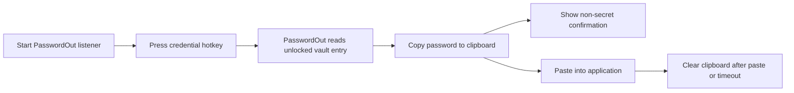
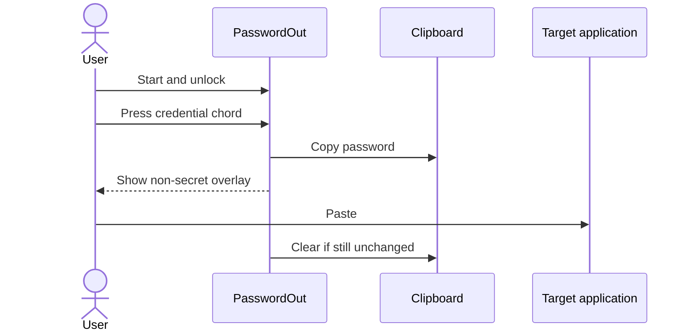

# PasswordOut User Guide

PasswordOut is a cross-platform, hotkey-driven credential manager for macOS and Windows.

You assign a global keyboard chord to each credential. While PasswordOut is running, pressing that chord copies the credential’s password to the clipboard temporarily and displays a confirmation that never shows the password itself.

This guide covers normal user operations. For build and development setup, see:

```text
INSTALLATION.md
DEVELOPER.md
CAC_ARCHITECTURE.md
VAULT_RECOVERY.md
ATOMIC_WRITES.md
```

---

## 1. How PasswordOut works



PasswordOut does not type the password directly into another application.

It copies the selected password to the system clipboard. You then paste it using the normal operating-system paste command.

| Platform | Paste shortcut |
|---|---|
| macOS | `Command+V` |
| Windows | `Ctrl+V` |

---

## 2. Command examples in this guide

Commands use:

```bash
password-out
```

When running directly from a development checkout, use:

```bash
cargo run --release -- <arguments>
```

Example:

```bash
cargo run --release -- vault info
```

This is equivalent to:

```bash
password-out vault info
```

On Windows, the executable may appear as:

```text
password-out.exe
```

---

## 3. Display command help

Show the main help:

```bash
password-out --help
```

Show help for a command group:

```bash
password-out vault --help

password-out entry --help
```

Show the installed version:

```bash
password-out --version
```

---

## 4. Vault location

PasswordOut uses its default platform-specific vault path unless you provide:

```bash
--vault <PATH>
```

To use an explicit vault path:

### macOS

```bash
password-out \
  --vault "$HOME/.config/password-out/vault.json" \
  vault info
```

### Windows MSYS2, Git Bash, or UCRT64

```bash
password-out \
  --vault "$HOME/.config/password-out/vault.json" \
  vault info
```

### Windows PowerShell

```powershell
password-out.exe `
  --vault "$HOME\.config\password-out\vault.json" `
  vault info
```

Using an explicit path is helpful when:

- maintaining multiple test vaults
- moving a vault between machines
- troubleshooting the default location
- testing password, CAC, and PFX vaults separately

Use the same `--vault` path for every command that should operate on that vault.

---

# Part I — Create a vault

## 5. Initialize a new vault

Run:

```bash
password-out vault init
```

PasswordOut asks which unlock method to use:

```text
1. Master password
2. CAC / PIV smart card
3. Software X.509 certificate (PFX)
```

The command refuses to overwrite an existing vault.

---

## 6. Option 1: master-password vault

Select:

```text
1
```

PasswordOut asks you to create and confirm a master password.

Use this password whenever you:

- add an entry
- list entries
- remove an entry
- start the listener
- inspect unlocked vault settings

Store the master password somewhere safe. PasswordOut cannot recover a password-only vault if the master password is lost.

---

## 7. Option 2: CAC / PIV smart-card vault

Select:

```text
2
```

PasswordOut:

1. connects to the first available smart-card reader
2. selects the PIV application
3. reads the key-management certificate from slot `9D`
4. displays non-secret certificate information
5. asks you to create a backup password
6. creates the certificate-protected vault

The displayed certificate details include information such as:

```text
Slot
Subject
Issuer
Expiration
SHA-256 fingerprint
```

The backup password is required if the CAC is:

- lost
- replaced
- expired
- unavailable
- no longer readable

### CAC requirements

Before running the command:

- connect the CAC reader
- insert the CAC
- confirm the operating system can see the reader
- know the CAC PIN

Note: PasswordOut automatically uses the CAC certificate intended for encryption. This certificate is stored in PIV slot 9D, and the program selects it automatically.

---

## 8. Option 3: software certificate (PFX)

Select:

```text
3
```

Then choose:

```text
1. Generate a new self-signed PFX
2. Use an existing PFX
```

### Generate a new PFX

PasswordOut asks for:

- PFX output path
- certificate common name
- PFX password
- backup password

Keep these items separate and secure:

```text
vault.json
vault.pfx
PFX password
backup password
```

The PFX and its password unlock the vault during normal use.

The backup password can recover the vault key if the PFX is lost or unavailable.

### Use an existing PFX

PasswordOut asks for:

- existing PFX path
- PFX password
- new backup password for the vault

The PFX must contain:

- an X.509 certificate
- its matching RSA private key

---

# Part II — Manage entries

## 9. Add a credential

Run:

```bash
password-out entry add
```

PasswordOut unlocks the vault and asks for:

```text
Domain
Username
Hotkey
Password
Expiration date
```

Example account:

```text
Domain: CONTOSO
Username: alice
```

PasswordOut displays this account as:

```text
CONTOSO\alice
```

The default domain is:

```text
domain
```

Press Enter at the domain prompt to use it.

---

## 10. Choose a credential hotkey

Every credential must have a unique global hotkey.

Supported primary keys include:

```text
A-Z
0-9
F1-F12
```

At least one modifier is required.

Supported canonical modifiers:

```text
CTRL
ALT
SHIFT
META
```

`META` means:

| Platform | Physical key |
|---|---|
| macOS | Command |
| Windows | Windows key |

Examples:

```text
CTRL+ALT+1
CTRL+ALT+SHIFT+P
META+SHIFT+F9
```

Do not use:

```text
CTRL+ALT+SHIFT+L
```

That chord is reserved for displaying the PasswordOut entry list.

---

## 11. Hotkey selection differs by platform

### macOS: type the chord

On macOS, PasswordOut asks:

```text
Hotkey:
```

Type the chord using canonical labels.

Example:

```text
CTRL+ALT+1
```

You can also type macOS-style aliases:

```text
CONTROL+OPTION+1
COMMAND+SHIFT+P
```

PasswordOut normalizes them to canonical form, such as:

```text
CTRL+ALT+1
META+SHIFT+P
```

It then attempts to register the chord temporarily to confirm that macOS accepts it.

If the chord is unavailable, enter another one.

### Windows: press the physical chord

On Windows, do not type the chord as text.

PasswordOut displays:

```text
Press the desired hotkey combination.
```

Physically press the modifier keys and primary key together.

Example:

```text
Ctrl+Alt+1
```

PasswordOut reports:

```text
Captured: CTRL+ALT+1
Hotkey is available.
```

If Windows or another application already owns the chord, PasswordOut rejects it and may suggest available alternatives.

Press:

```text
Esc
```

to cancel Windows hotkey capture.

---

## 12. Enter the password

At the password prompt, input is hidden.

The password is encrypted inside the vault. It is not shown in:

- entry listings
- overlays
- normal console output
- vault metadata output

---

## 13. Set an optional expiration date

PasswordOut asks:

```text
Expiration date (YYYY-MM-DD, optional):
```

Example:

```text
2026-12-31
```

Press Enter for no expiration date.

The date must:

- use exactly `YYYY-MM-DD`
- represent a real calendar date

Examples:

```text
Valid:   2026-12-31
Invalid: 12/31/2026
Invalid: 2026-02-30
```

When the expiration date is within the warning window, the copy confirmation includes a warning such as:

```text
Password expires in 10 days
```

Other possible messages include:

```text
Password expires today
Password expired 1 day ago
Password expired 5 days ago
```

Warnings are calculated when the listener starts. Restart the listener after changing vault entries.

---

## 14. List entries

Run:

```bash
password-out entry list
```

PasswordOut unlocks the vault and displays non-secret metadata:

```text
DOMAIN
USERNAME
HOTKEY
EXPIRES
```

Passwords are never displayed.

Example:

```text
DOMAIN           USERNAME                 HOTKEY               EXPIRES
CONTOSO          alice                    CTRL+ALT+1           2026-12-31
domain           local-admin              CTRL+ALT+2           -
```

A dash means no expiration date is configured.

---

## 15. Remove an entry

Run:

```bash
password-out entry remove
```

PasswordOut:

1. unlocks the vault
2. displays existing entries
3. asks for domain
4. asks for username
5. asks for exact confirmation

You must type:

```text
REMOVE
```

to permanently delete the entry.

Any other response cancels removal.

---

# Part III — Use the listener

## 16. Start PasswordOut

Run:

```bash
password-out --listen
```

PasswordOut unlocks the vault before registering hotkeys.

### Master-password vault

Enter:

```text
Master password
```

### PFX vault

Enter or confirm:

```text
PFX path
PFX password
```

### CAC vault

PasswordOut:

1. connects to CAC slot `9D`
2. prompts for the CAC PIN
3. verifies the PIN once
4. unlocks the vault
5. registers the credential hotkeys

Incorrect CAC PINs are not automatically retried. Restart the command and try again carefully.

---

## 17. Leave the listener running

After startup, PasswordOut prints the registered accounts and hotkeys.

Example:

```text
PasswordOut listening globally...
Registered hotkeys:
 CONTOSO\alice        CTRL+ALT+1
 CONTOSO\bob          CTRL+ALT+2
 show entry list      CTRL+ALT+SHIFT+L
```

Keep that terminal or process running.

Stop the listener with:

```text
Ctrl+C
```

---

## 18. Copy and paste a credential

1. Click the application that needs the password.
2. Press the credential hotkey.
3. PasswordOut copies the password.
4. A non-secret overlay confirms which account was copied.
5. Paste normally.

### macOS

```text
Command+V
```

### Windows

```text
Ctrl+V
```

Example overlay:

```text
Password for CONTOSO\alice copied to clipboard
Expires: 2026-12-31
Password expires in 10 days
```

The actual password is never shown in the overlay.

---

## 19. Clipboard clearing behavior

After a password is copied, PasswordOut starts a countdown.

The clipboard is cleared only when it still contains the password copied by PasswordOut.

If you copy something else before the timeout, PasswordOut stops tracking the old password and does not erase your newer clipboard content.

### Windows

Windows also monitors common paste chords. After a detected paste, PasswordOut attempts to clear the active PasswordOut password shortly afterward.

Recognized paste combinations include:

```text
Ctrl+V
Shift+Insert
```

### macOS

The password remains available until:

- the timeout expires
- you replace the clipboard content
- you use the PasswordOut manual clear hotkey

---

## 20. Manual clipboard clear on macOS

While a PasswordOut password is active, press:

```text
Control+Option+Space
```

Canonical form:

```text
CTRL+ALT+SPACE
```

PasswordOut clears the clipboard only if it still contains the active PasswordOut password.

This built-in manual-clear chord currently applies to macOS.

---

## 21. Show the entry list

Hold:

```text
CTRL+ALT+SHIFT+L
```

The overlay displays account names and their assigned hotkeys.

Release the chord to hide the list.

The list does not show passwords.

Expiration dates and active expiration warnings may also appear.

### macOS physical keys

```text
Control+Option+Shift+L
```

### Windows physical keys

```text
Ctrl+Alt+Shift+L
```

---

## 22. Override clipboard timeout for one listener session

Run:

```bash
password-out \
  --clear-seconds 15 \
  --listen
```

This uses a 15-second timeout for that process.

It does not necessarily change the timeout stored inside the vault.

---

## 23. Change the saved clipboard timeout

When the installed version includes the vault-timeout command, run:

```bash
password-out vault timeout
```

PasswordOut:

1. unlocks the vault
2. displays the current timeout
3. asks for a new whole number of seconds
4. saves the new setting

Press Enter to keep the current value.

The configured range is:

```text
1 to 86400 seconds
```

The normal default is:

```text
30 seconds
```

A command-line `--clear-seconds` value can override the stored value for a listener session.

Check your installed command list with:

```bash
password-out vault --help
```

---

# Part IV — Vault information and recovery

## 24. Display vault information

Run:

```bash
password-out vault info
```

PasswordOut displays non-secret metadata such as:

```text
Vault path
Format version
Unlock method
Payload cipher
Password KDF
Certificate backend
Certificate subject and issuer
Certificate expiration
Certificate fingerprint
Backup-recovery status
Clipboard timeout
```

The command does not display credential passwords.

Some metadata can be read without decrypting entries, while entry settings require normal vault unlock.

---

## 25. Recover a certificate or CAC vault

Run:

```bash
password-out vault recover
```

Enter the backup password created during vault initialization.

PasswordOut:

1. reads the backup-password wrapper
2. recovers the existing random vault key
3. verifies that the payload decrypts
4. reports how many entries were recovered
5. leaves the vault protection unchanged

Recovery does not automatically replace the CAC or PFX.

Expected success output includes:

```text
Vault recovery successful.
Entries recovered: <count>
Vault protection: unchanged
```

Password-only vaults do not use this recovery command.

---

## 26. Rotate a certificate

Run:

```bash
password-out vault rotate-certificate
```

PasswordOut asks for:

1. current backup password
2. replacement certificate source
3. replacement PFX information

Current rotation choices are:

```text
1. Generate a new self-signed PFX
2. Use an existing PFX
```

After successful rotation:

- the new PFX unlocks the vault
- the old certificate no longer unlocks it
- the backup password remains unchanged
- the encrypted credential payload remains intact

Keep the replacement PFX and its password secure.

---

# Part V — Platform setup notes

## 27. macOS permissions

Global hotkeys may require macOS privacy permission for the terminal or application used to run PasswordOut.

Open:

```text
System Settings
  → Privacy & Security
```

Check the relevant application under:

```text
Input Monitoring
Accessibility
```

Examples of applications that may need permission:

```text
Terminal
Ghostty
iTerm2
password-out
```

After changing permissions:

1. stop PasswordOut
2. quit and reopen the terminal if necessary
3. start the listener again

Do not grant permission to applications you do not trust.

---

## 28. Windows terminal choice

For the GNU development build, use:

```text
MSYS2 UCRT64
```

The prompt should include:

```text
UCRT64
```

For a packaged Windows executable, PowerShell or Command Prompt may also be used.

Windows hotkey capture relies on observing the physical key state, so keep the PasswordOut terminal focused while assigning a new hotkey.

---

## 29. Smart-card support

CAC/PIV operation requires:

- a compatible reader
- the PC/SC smart-card service
- a readable CAC
- access to slot `9D`
- the correct PIN

Only one PIN verification is attempted during provider creation. PasswordOut does not repeatedly retry a wrong PIN, which helps avoid accidental card lockout.

---

# Part VI — Common workflows

## 30. First-time master-password workflow

```bash
password-out vault init

password-out entry add

password-out entry list

password-out --listen
```

Then press the assigned chord and paste into the target application.

---

## 31. First-time CAC workflow

```bash
password-out vault init
```

Choose:

```text
2. CAC / PIV smart card
```

Then:

```bash
password-out entry add

password-out entry list

password-out --listen
```

Keep the CAC inserted while unlocking and starting the listener.

Once the vault is loaded and the listener is running, credential hotkeys use the in-memory unlocked entries.

---

## 32. First-time PFX workflow

```bash
password-out vault init
```

Choose:

```text
3. Software X.509 certificate (PFX)
```

Then add entries:

```bash
password-out entry add
```

Start the listener:

```bash
password-out --listen
```

Provide the PFX path and password when prompted.

---

## 33. Use a separate test vault

### macOS or Windows Bash-style shell

```bash
password-out \
  --vault "$HOME/password-out-test/vault.json" \
  vault init
```

Add an entry to the same vault:

```bash
password-out \
  --vault "$HOME/password-out-test/vault.json" \
  entry add
```

Start its listener:

```bash
password-out \
  --vault "$HOME/password-out-test/vault.json" \
  --listen
```

Do not run multiple listeners with overlapping hotkeys.

---

## 34. Temporarily use a shorter timeout

```bash
password-out \
  --clear-seconds 10 \
  --listen
```

This is useful while testing clipboard behavior.

---

# Part VII — Troubleshooting

## 35. “Hotkey is already registered”

Another application or the operating system owns that chord.

Use a different combination.

Good candidates commonly include three modifiers:

```text
CTRL+ALT+SHIFT+1
CTRL+ALT+SHIFT+2
CTRL+ALT+F9
CTRL+ALT+F10
```

Avoid shortcuts already used by:

- the desktop environment
- screen-capture tools
- terminal emulators
- remote-desktop clients
- accessibility software
- keyboard utilities
- game overlays

---

## 36. Hotkey works in the terminal but not globally

### macOS

Check:

```text
System Settings
  → Privacy & Security
  → Input Monitoring
  → Accessibility
```

Restart the terminal and listener afterward.

### Windows

Check whether:

- another process already registered the chord
- the listener is still running
- the listener reported a registration error
- the hotkey includes at least one modifier
- you are using a supported primary key

---

## 37. Password is copied but paste does not work

Check whether:

- the timeout expired
- another application replaced the clipboard
- a clipboard manager modified the clipboard
- the target application blocks normal paste
- you pressed the correct platform paste chord

Try pasting immediately after pressing the credential hotkey.

---

## 38. The clipboard is not cleared

PasswordOut intentionally avoids clearing clipboard content that has changed.

For example:

1. PasswordOut copies a password.
2. You copy ordinary text.
3. The PasswordOut timeout expires.
4. PasswordOut sees that the clipboard no longer matches the password.
5. Your newer text remains.

This is expected behavior.

---

## 39. Entry list does not appear

Confirm the listener printed:

```text
show entry list      CTRL+ALT+SHIFT+L
```

Then hold all four keys together.

### macOS

```text
Control+Option+Shift+L
```

### Windows

```text
Ctrl+Alt+Shift+L
```

If it still fails, check global-hotkey permissions or conflicts.

---

## 40. Expiration warning does not appear

Confirm:

- the entry has a valid expiration date
- the date is within the configured warning period
- the listener was restarted after the entry was added or changed
- you are running the newly built or installed executable

A distant expiration date shows the expiration date without a warning.

---

## 41. Vault file already exists

`vault init` refuses to overwrite an existing vault.

Use one of these approaches:

- continue using the existing vault
- provide a different `--vault` path
- back up and deliberately move the old vault
- create a separate test directory

Do not delete a vault until you have confirmed any required backup, PFX, CAC, and recovery credentials are available.

---

## 42. PFX file cannot be found

Use an explicit path:

### macOS or Bash-style shell

```bash
password-out \
  --vault "$HOME/.config/password-out/vault.json" \
  --listen
```

At the prompt, enter:

```text
/complete/path/to/vault.pfx
```

### Windows

A Windows path may be entered in the style accepted by the shell you are using.

PowerShell example:

```text
C:\Users\alice\Documents\vault.pfx
```

MSYS2 example:

```text
/c/Users/alice/Documents/vault.pfx
```

---

## 43. CAC is not detected

Check:

- reader USB connection
- card insertion
- operating-system smart-card service
- reader visibility outside PasswordOut
- card orientation
- whether another program has exclusive access to the card

Disconnect and reconnect the reader, then rerun the command.

---

## 44. CAC PIN failed

PasswordOut does not automatically retry the PIN.

Stop the command and start it again.

Be careful: repeated incorrect PIN attempts can lock the CAC.

Do not test unknown PINs.

---

## 45. Recovery password does not work

Confirm that you are using:

```text
the vault backup password
```

not:

```text
the PFX password
the CAC PIN
the master password from another vault
```

These are separate credentials.

A certificate-backed vault commonly has:

| Credential | Purpose |
|---|---|
| CAC PIN | authorize CAC private-key operation |
| PFX password | decrypt software private key |
| Backup password | recover the vault key when certificate access is unavailable |

---

# Part VIII — Security guidance

## 46. Protect the vault and recovery material

Do not store all recovery material together.

For a PFX vault, avoid keeping these in one unprotected folder:

```text
vault.json
vault.pfx
PFX password
backup password
```

For a CAC vault, protect:

```text
vault.json
CAC PIN
backup password
```

The encrypted vault still contains sensitive metadata and should be protected with normal filesystem permissions and backups.

---

## 47. Clipboard risk

While a password is in the clipboard, other software running as your user may be able to read it.

PasswordOut reduces exposure time, but it cannot protect against:

- malware
- hostile clipboard managers
- debuggers
- accessibility abuse
- compromised administrator accounts
- screen or input capture
- a compromised operating system

Use the shortest practical clipboard timeout.

---

## 48. Overlays never show passwords

A normal PasswordOut overlay may show:

```text
account
expiration date
expiration warning
copy confirmation
countdown
```

It must never show:

```text
password
CAC PIN
PFX password
master password
backup password
vault key
```

Stop using the program and report the issue privately if a secret ever appears in an overlay or log.

---

## 49. Back up encrypted vaults

Maintain backups of:

```text
vault.json
```

For PFX-backed vaults, also back up:

```text
the required PFX
```

Store recovery credentials separately.

Test recovery periodically with disposable copies rather than waiting for an emergency.

---

# Part IX — Command reference

## 50. Main commands

```bash
password-out vault init

password-out vault info

password-out vault recover

password-out vault rotate-certificate

password-out vault timeout

password-out entry add

password-out entry list

password-out entry remove

password-out --listen
```

Confirm the exact commands supported by your installed version:

```bash
password-out --help

password-out vault --help

password-out entry --help
```

---

## 51. Global options

```text
--vault <PATH>
--clear-seconds <SECONDS>
--listen
--help
--version
```

Examples:

```bash
password-out \
  --vault "/path/to/vault.json" \
  entry list
```

```bash
password-out \
  --vault "/path/to/vault.json" \
  --clear-seconds 15 \
  --listen
```

---

## 52. Built-in hotkeys

| Purpose | Canonical chord | macOS keys | Windows keys |
|---|---|---|---|
| Show entry list | `CTRL+ALT+SHIFT+L` | Control+Option+Shift+L | Ctrl+Alt+Shift+L |
| Clear active clipboard secret | `CTRL+ALT+SPACE` | Control+Option+Space | Not currently exposed as the same built-in Windows chord |

Credential-specific hotkeys are chosen when entries are added.

---

## 53. Platform behavior summary

| Behavior | macOS | Windows |
|---|---|---|
| Add-entry hotkey selection | Type canonical chord | Physically press chord |
| Global credential hotkeys | Yes | Yes |
| Entry-list overlay | Hold built-in chord | Hold built-in chord |
| Manual PasswordOut clear chord | Yes | Not currently equivalent |
| Clear after detected paste | Not the primary behavior | Supports `Ctrl+V` and `Shift+Insert` monitoring |
| Normal paste | Command+V | Ctrl+V |
| META modifier | Command | Windows key |
| Native privacy permission may be required | Yes | No macOS-style permission |
| CAC/PIV provider | Supported by project architecture | Supported by project architecture |

---

## 54. Recommended daily workflow

1. Start PasswordOut.
2. Unlock the vault.
3. Leave the listener running.
4. Hold the entry-list chord when you forget a credential chord.
5. Press the desired credential chord.
6. Paste immediately.
7. Allow PasswordOut to clear the clipboard.
8. Stop the listener when it is no longer needed.



PasswordOut is designed to keep this routine fast while keeping secret display and clipboard exposure limited.
