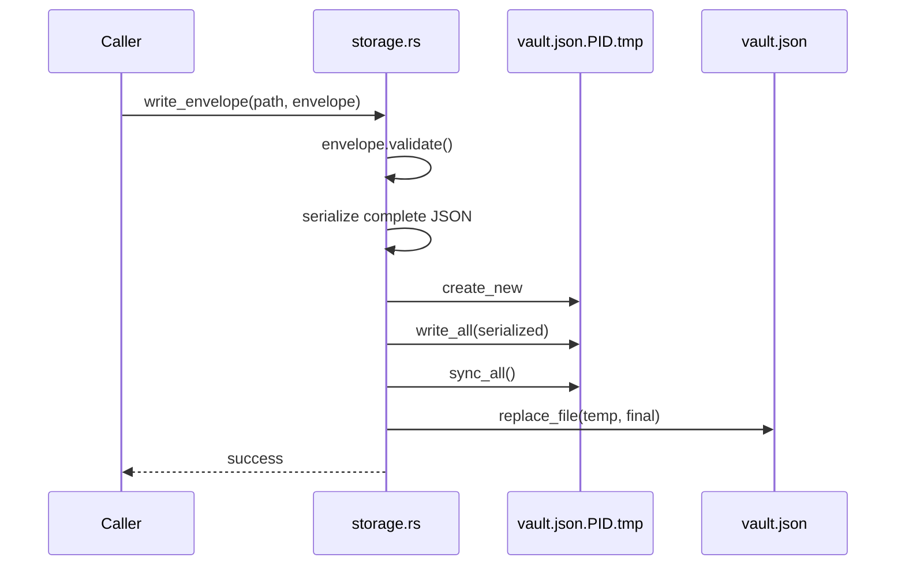
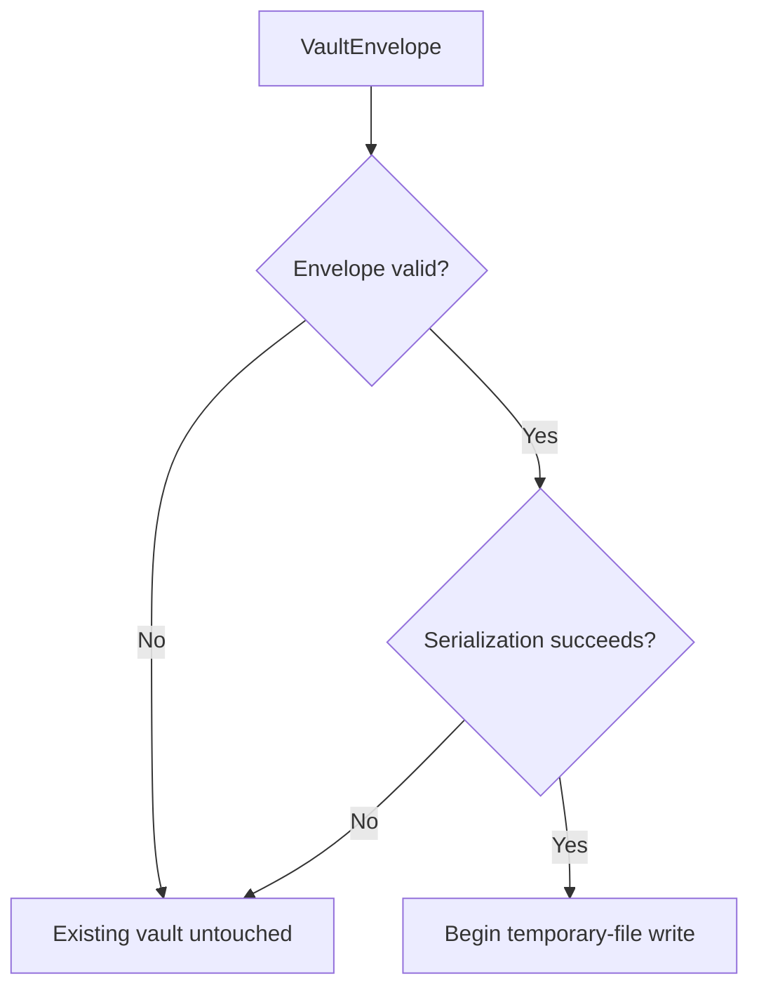
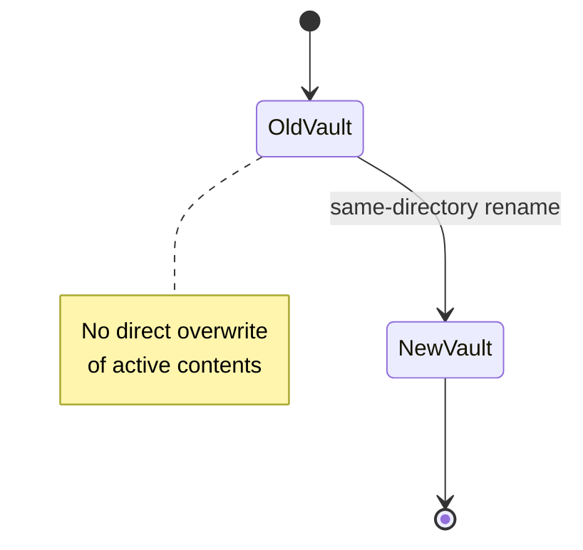
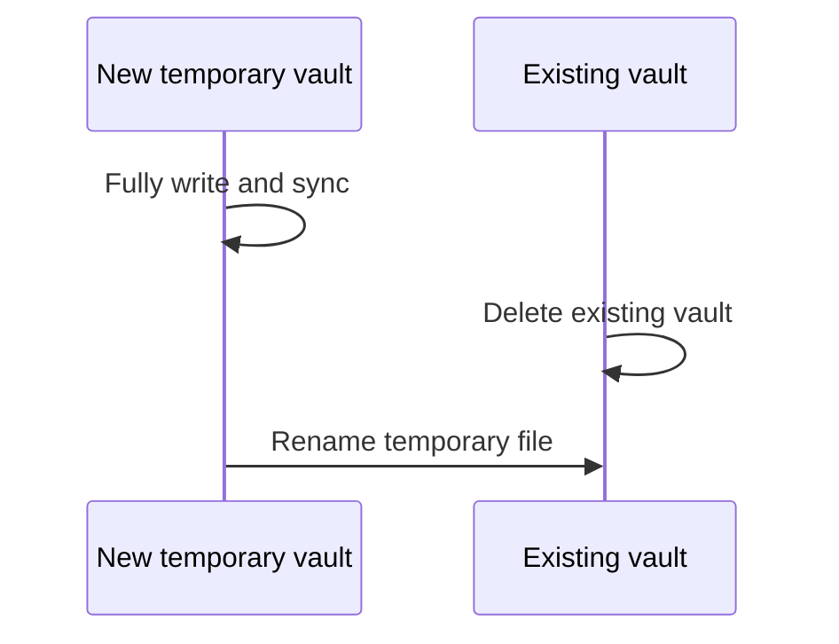
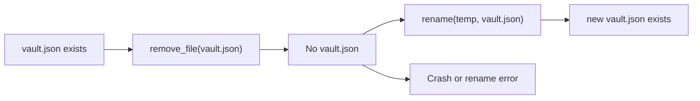
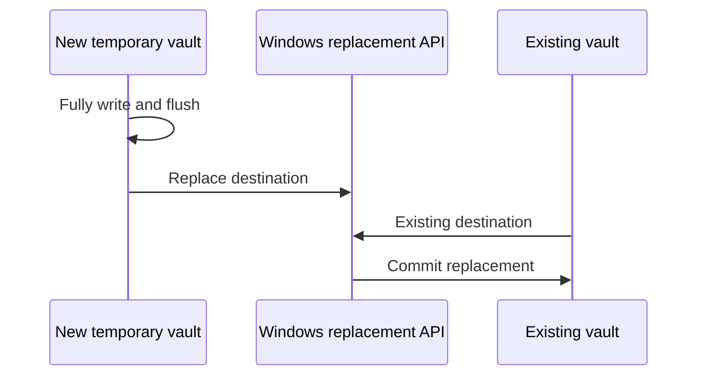
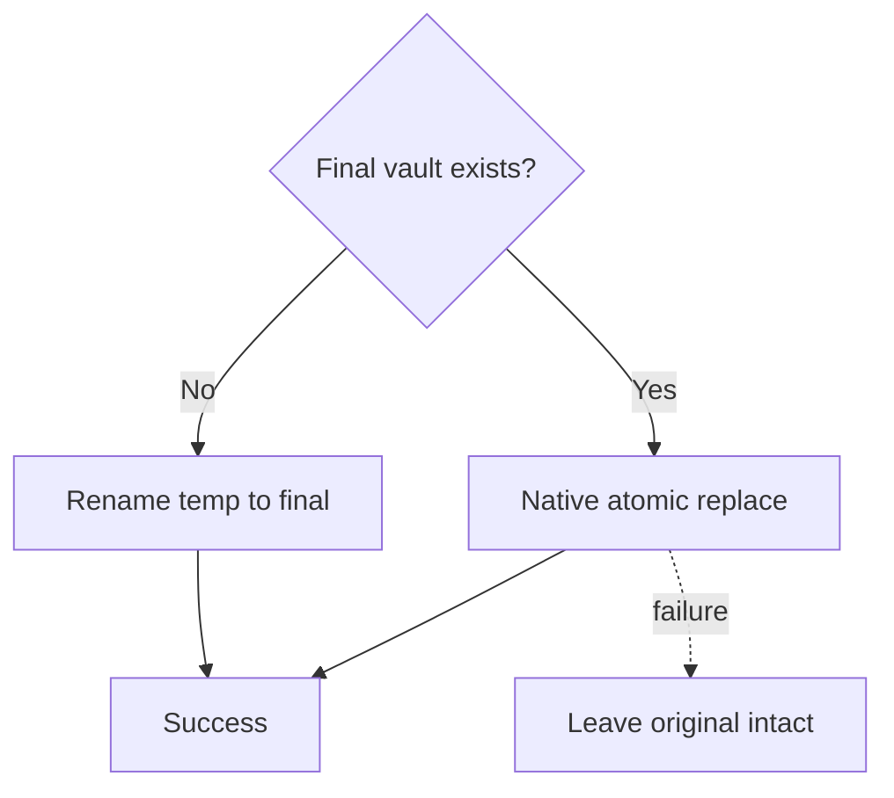
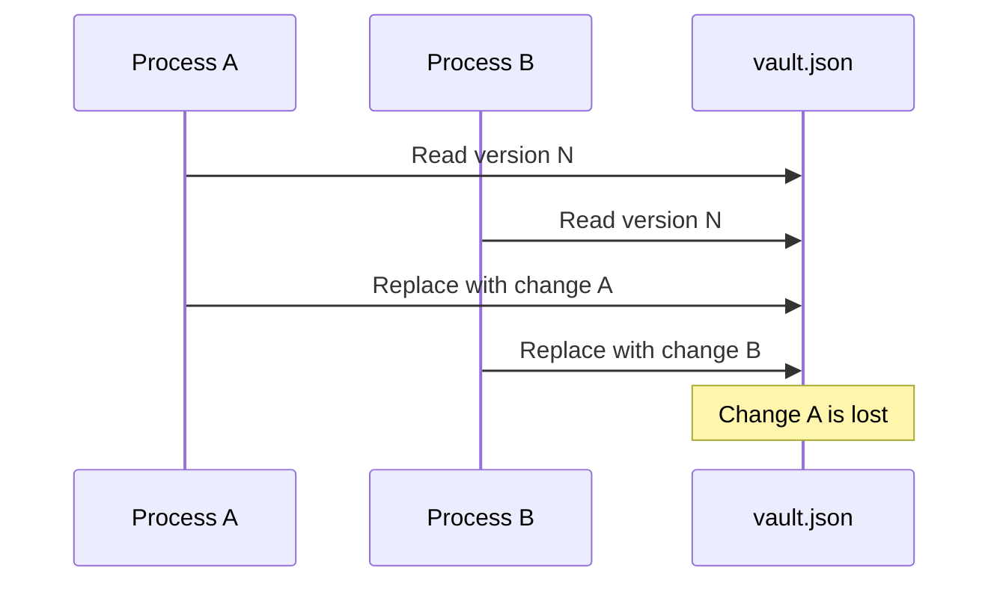
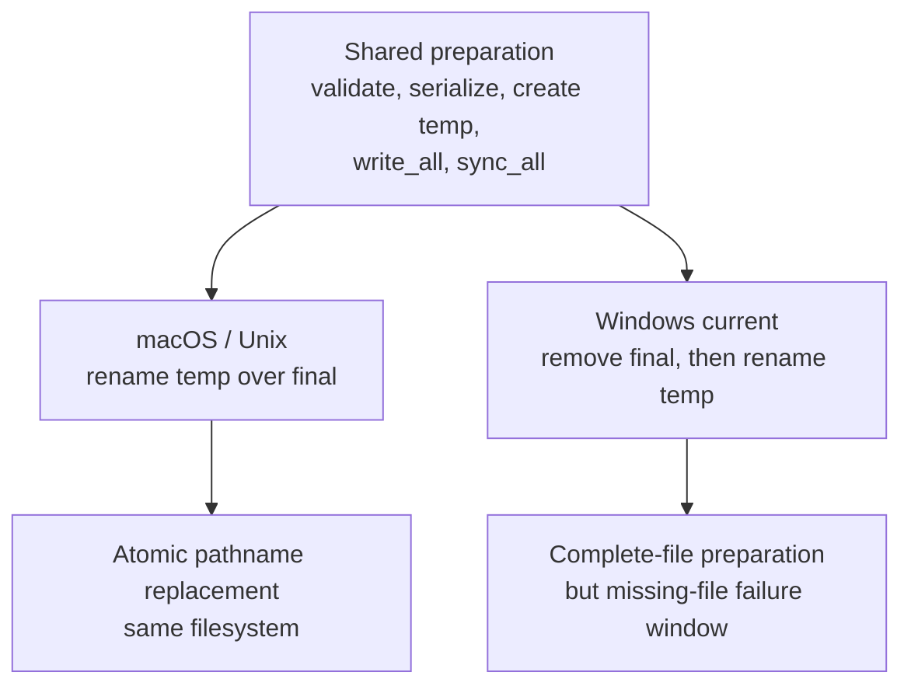

# PasswordOut Atomic Vault Write Strategy

This document explains how PasswordOut writes encrypted vault files on macOS and Windows, what guarantees the current implementation provides, and where the Windows strategy should be strengthened.

The implementation is centered in:

```text
src/vault/storage.rs
```

---

## 1. Why atomic replacement matters

A vault update must not leave behind:

- partially written JSON
- truncated ciphertext
- half-updated metadata
- a mixture of old and new envelope fields
- a missing vault after an interrupted save

PasswordOut therefore does not write directly into the active `vault.json`.

It follows a prepare-then-replace model:


The replacement step differs by operating system.

---

## 2. Quick reference

| Goal | File |
|---|---|
| Change vault read/write behavior | `src/vault/storage.rs` |
| Change envelope validation | `src/vault/format.rs` |
| Change encryption before storage | `src/vault/crypto.rs` |
| Change save-session behavior | `src/vault/service.rs` |
| Test failed replacement | `src/vault/storage.rs` tests |
| Add Windows native replacement API | `src/vault/storage.rs` |
| Change directory/file permissions | `src/vault/storage.rs` |

---

## 3. Current write pipeline

The public function is:

```rust
write_envelope(path, envelope)
```

Its current responsibilities are:

1. validate the envelope
2. create the parent directory
3. apply restrictive directory permissions on Unix
4. serialize the complete envelope in memory
5. choose a temporary path beside the final vault
6. create the temporary file with `create_new`
7. write all bytes
8. call `sync_all()` on the temporary file
9. replace the final vault
10. remove the temporary file after a pre-replacement write failure



---

## 4. Temporary file placement

The temporary file is created in the same directory as the final vault.

Example:

```text
vault.json
vault.json.12345.tmp
```

The process ID is included in the temporary filename.

Current helper:

```rust
fn temporary_path(path: &Path) -> PathBuf
```

### Why the same directory is important

Keeping both files in the same directory generally means:

- they are on the same filesystem or volume
- rename does not become a cross-filesystem copy
- Unix replacement can use atomic rename semantics
- Windows native replacement APIs can operate on both paths
- directory permissions apply to both files

A temporary file in `/tmp` or another volume would weaken these guarantees.

---

## 5. Temporary file creation

PasswordOut uses:

```rust
OpenOptions::new()
    .write(true)
    .create_new(true)
```

`create_new(true)` prevents opening an existing path for overwrite.

This provides two useful protections:

- an existing temporary file is not silently overwritten
- the operation fails rather than following a stale path unexpectedly

On Unix, the file is created with:

```text
0600
```

through:

```rust
OpenOptionsExt::mode(0o600)
```

This restricts the temporary encrypted vault to the current user.

---

## 6. Complete serialization before disk write

PasswordOut first creates the full JSON representation in memory:

```rust
serde_json::to_vec_pretty(envelope)
```

Only after successful serialization does it create and write the temporary file.

This means serialization failure cannot damage the active vault.



---

## 7. Flushing the temporary file

After `write_all`, PasswordOut calls:

```rust
file.sync_all()
```

This asks the operating system to flush file content and associated file metadata.

The intent is to avoid replacing the active vault with a temporary file whose data only exists in process or kernel buffers.

### Guarantee boundary

`sync_all()` improves durability of the temporary file.

It does not by itself guarantee:

- the parent directory entry is durable
- the rename is durable after immediate power loss
- every storage device has physically committed its cache
- Windows replacement is atomic

The final replacement operation and directory durability still matter.

---

## 8. macOS and Unix strategy

Current Unix implementation:

```rust
#[cfg(unix)]
fn replace_file(temp_path: &Path, final_path: &Path) -> Result<(), String> {
    fs::rename(temp_path, final_path)
        .map_err(...)
}
```

macOS follows this branch because macOS is Unix.

### Replacement behavior

When:

- the temporary file and final file are in the same directory
- both paths are on the same filesystem
- the filesystem supports normal rename semantics

the final rename replaces the destination as a single namespace operation.

Readers observe either:

- the old complete vault
- the new complete vault

They should not observe partially copied contents.



### macOS failure behavior

Before rename:

- the old vault remains intact
- temporary write failures are cleaned up

If rename fails:

- the old vault normally remains intact
- the temporary file may remain and should be treated as recovery debris

After successful rename:

- `vault.json` refers to the new complete file
- the old directory entry is replaced

---

## 9. Is the macOS write fully durable?

It is atomic at the pathname replacement level, but full crash durability can be strengthened.

Current sequence:

```text
write temp
sync temp
rename temp over final
return success
```

A stronger Unix/macOS sequence is:

```text
write temp
sync temp
rename temp over final
open parent directory
sync parent directory
return success
```

Why sync the directory?

The rename changes directory metadata. Syncing the file does not necessarily guarantee that the directory-entry replacement survives immediate power loss.

### Recommended macOS improvement

After successful rename:

```rust
let directory = File::open(parent)?;
directory.sync_all()?;
```

This must be tested on supported platforms because directory syncing behavior differs across operating systems and filesystems.

---

## 10. Current Windows strategy

Current Windows implementation:

```rust
#[cfg(windows)]
fn replace_file(temp_path: &Path, final_path: &Path) -> Result<(), String> {
    if final_path.exists() {
        fs::remove_file(final_path)?;
    }

    fs::rename(temp_path, final_path)
}
```

### Current Windows sequence



### What this protects against

The current Windows implementation still protects against:

- partial JSON serialization
- direct truncation of the active vault
- replacing the vault before the new file is fully written
- many ordinary write failures

### What it does not guarantee

There is a gap between:

```text
remove old vault
rename new vault
```

If the process, operating system, storage device, or rename operation fails during that gap:

- the old vault is already gone
- the new vault may still have its temporary name
- `vault.json` may be missing

Therefore, the current Windows replacement strategy is not fully atomic.

---

## 11. Windows failure window



The temporary file may still contain the complete new vault, but automatic recovery is not currently implemented.

---

## 12. Recommended Windows replacement strategy

Windows should use a native replacement operation instead of delete-then-rename.

Preferred options include:

- `ReplaceFileW`
- `MoveFileExW` with replacement flags
- a well-reviewed Rust crate that provides correct Windows atomic replacement semantics

A likely PasswordOut implementation is:

```text
write temporary file
sync temporary file
call ReplaceFileW(final, temp, ...)
return success
```

or an equivalent documented Windows operation.



### Design requirements

The Windows implementation should:

1. keep temp and final files on the same volume
2. replace an existing destination without deleting it first
3. fail without destroying the original destination
4. support initial creation when no destination exists
5. preserve or explicitly set intended permissions
6. remove stale temporary files on failure when safe
7. return accurate native error information
8. avoid following links or unexpected reparse points where possible
9. be tested under antivirus/file-lock contention
10. be tested with simulated replacement failure

---

## 13. Initial creation versus replacement

The code must handle two cases.

### No existing vault

```text
temporary file -> final filename
```

A normal same-volume rename is usually sufficient.

### Existing vault

```text
temporary file atomically replaces final filename
```

This requires replacement semantics, not merely destination creation.

Suggested control flow:



---

## 14. Cross-platform target design

The desired abstraction remains:

```rust
fn replace_file(temp_path: &Path, final_path: &Path) -> Result<(), String>
```

Platform implementations:

```rust
#[cfg(unix)]
fn replace_file(...)

#[cfg(windows)]
fn replace_file(...)
```

### Desired Unix/macOS implementation

```text
rename temp over final
sync parent directory
```

### Desired Windows implementation

```text
if final exists:
    use native replacement API
else:
    rename temp to final
```

The rest of `write_envelope` can remain platform-neutral.

---

## 15. Read consistency

`read_envelope` currently:

1. opens the final path
2. reads the complete file into a string
3. parses JSON
4. validates the envelope

Because writers use a separate temporary path, readers do not open the temporary file.

On macOS/Unix atomic rename means a reader opening `vault.json` sees one version.

On current Windows code, a reader can briefly receive “file not found” during the delete/rename gap.

Native Windows replacement removes that gap.

---

## 16. Cleanup behavior

Current pre-replacement behavior:

```rust
if write_temp_file(...) fails {
    remove_file(temp_path)
    return error
}
```

This is good because the active vault is untouched.

### Replacement failure

The implementation should decide whether to retain or remove a complete temporary vault after replacement failure.

Tradeoff:

- removing it avoids stale sensitive files
- retaining it may permit manual recovery after the destination is lost
- encrypted data is still sensitive metadata and should not accumulate

Recommended policy:

- if the original vault is confirmed intact, remove the temp file
- if replacement state is uncertain, preserve temp and report its path
- never silently delete the only confirmed complete copy

---

## 17. Temporary-name uniqueness

Current temporary name:

```text
vault.json.<process-id>.tmp
```

This avoids collisions between different processes in many cases, but not all cases.

A process can:

- crash and leave its temp file
- restart with a reused process ID
- encounter a stale file from an older run

Because creation uses `create_new`, collision fails safely rather than overwriting the stale file.

### Recommended enhancement

Use a random UUID or random nonce:

```text
vault.json.<uuid>.tmp
```

Example:

```rust
format!("{file_name}.{}.tmp", Uuid::new_v4())
```

This improves uniqueness across:

- process restarts
- PID reuse
- concurrent saves
- stale files

---

## 18. Concurrent writers

The current write design does not implement a vault-wide file lock.

Two PasswordOut processes can theoretically:

1. read the same old vault
2. make different changes
3. each write a complete temporary file
4. last replacement wins

Atomic replacement prevents partial files, but it does not prevent lost updates.



Future concurrency controls could include:

- exclusive lock file
- OS file locking
- generation/version field
- compare-before-replace
- single-instance enforcement

Atomic writes and concurrency control solve different problems.

---

## 19. Permissions

### macOS/Unix

Current behavior:

- parent directory: `0700`
- temporary vault file: `0600`

After rename, the final file inherits the temporary file’s mode.

### Windows

Current non-Unix permission helper is a no-op.

Windows relies on:

- inherited directory ACLs
- user profile/config directory ACLs
- filesystem security descriptors

A stronger Windows implementation could explicitly verify or set an ACL limited to the current user.

That is separate from atomic replacement but belongs in the same storage threat model.

---

## 20. Current tests

Storage tests are in:

```text
src/vault/storage.rs
```

The project has tests for:

- write/read round trip
- replacing an existing vault
- preserving the original after a failed replacement
- cleaning temporary files
- unique temporary paths

Review the exact test set whenever `replace_file` changes.

---

## 21. Tests required for a native Windows replacement

Add Windows-specific tests for:

1. replacement succeeds when destination exists
2. creation succeeds when destination is absent
3. destination remains readable after replacement
4. replacement failure preserves original bytes
5. temporary file cleanup is correct
6. open destination handle behavior is understood
7. read-only destination returns a clear error
8. antivirus-style sharing violation returns a clear error
9. Unicode paths work
10. long paths work when supported
11. replacement does not create a missing-file window
12. no plaintext secret appears in errors or filenames

Some tests may need a Windows CI runner.

---

## 22. Failure matrix

| Failure point | macOS/Unix current result | Windows current result |
|---|---|---|
| envelope validation | old vault unchanged | old vault unchanged |
| serialization | old vault unchanged | old vault unchanged |
| temp create | old vault unchanged | old vault unchanged |
| temp write | old vault unchanged; temp cleanup attempted | same |
| temp sync | old vault unchanged; temp cleanup attempted | same |
| Unix rename failure | old vault normally unchanged | not applicable |
| Windows delete failure | old vault remains | save fails |
| Windows rename after successful delete fails | not applicable | final path may be missing |
| process crash before replacement | old vault remains | old vault remains |
| process crash during replacement | old or new path on Unix | possible missing final path on current Windows |
| power loss immediately after rename | rename durability filesystem-dependent | replacement durability filesystem/API-dependent |

---

## 23. Recommended implementation roadmap

### Phase 1: document current guarantee

State clearly:

- macOS/Unix replacement is atomic at the path level
- Windows temp creation is safe, but final replacement is not yet fully atomic

### Phase 2: replace Windows delete/rename

Implement `ReplaceFileW` or an equivalent native API.

Likely dependency area:

```text
windows-sys
```

Required Windows API modules will depend on the chosen function.

### Phase 3: strengthen durability

macOS/Unix:

- sync parent directory after rename

Windows:

- request write-through behavior where appropriate
- verify native replacement API semantics
- consider opening directory/volume handles only if justified

### Phase 4: strengthen temporary naming

Use UUID-based temp filenames.

### Phase 5: add concurrency protection

Introduce a lock or generation check if multiple processes may modify the same vault.

---

## 24. Security invariants

1. Never write directly into the active vault file.
2. Validate before creating a temporary file.
3. Serialize the complete envelope before replacement.
4. Use a temporary file in the same directory.
5. Create the temporary file with exclusive creation.
6. Restrict Unix file permissions to the current user.
7. Write all bytes before replacement.
8. Sync the temporary file before replacement.
9. Do not delete the active vault before a replacement operation that can preserve it.
10. On failure, preserve at least one confirmed complete vault copy.
11. Never place plaintext credentials in temporary files.
12. Never include secrets in filenames or errors.
13. Atomic replacement does not replace the need for locking.
14. Test both destination-exists and destination-missing paths.
15. Treat Windows replacement as incomplete until delete-then-rename is removed.

---

## 25. Current implementation summary



The current code has a strong shared preparation phase.

The macOS/Unix final replacement uses the correct atomic-rename model.

The Windows final replacement should be upgraded from delete-then-rename to a native replacement operation before PasswordOut describes Windows vault replacement as fully atomic.
