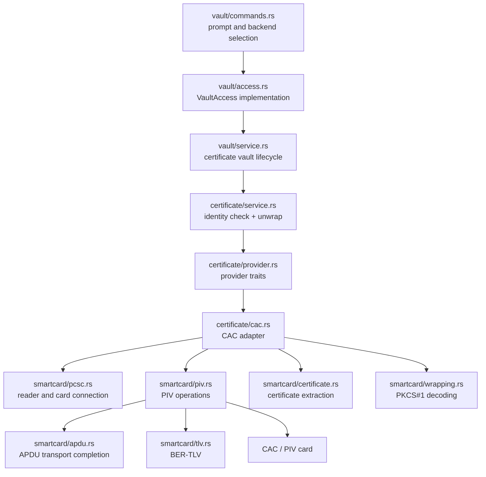
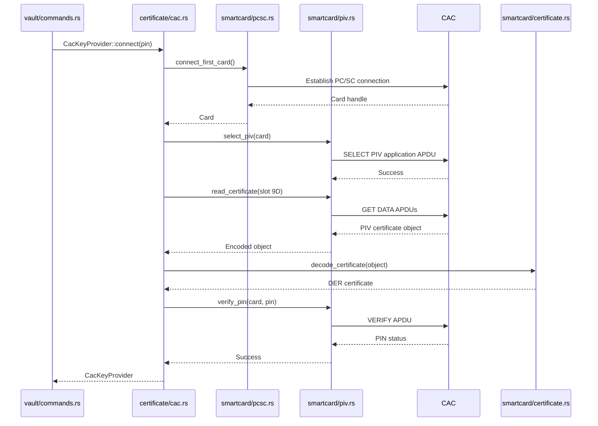
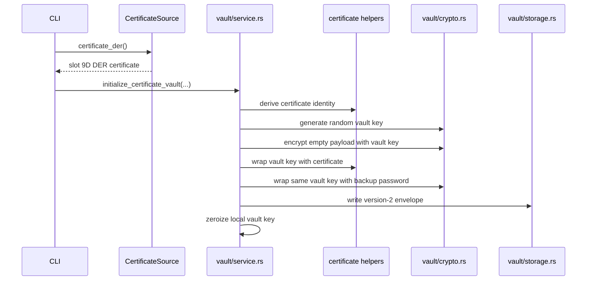
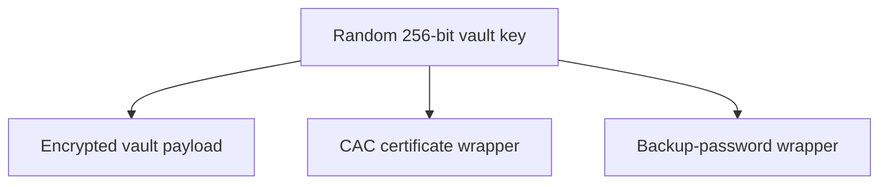
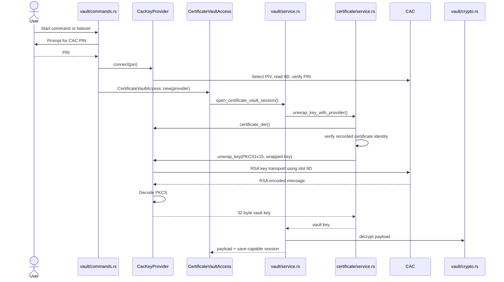
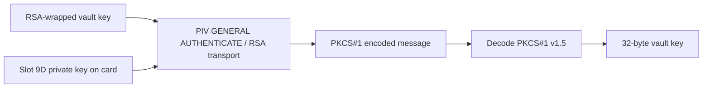
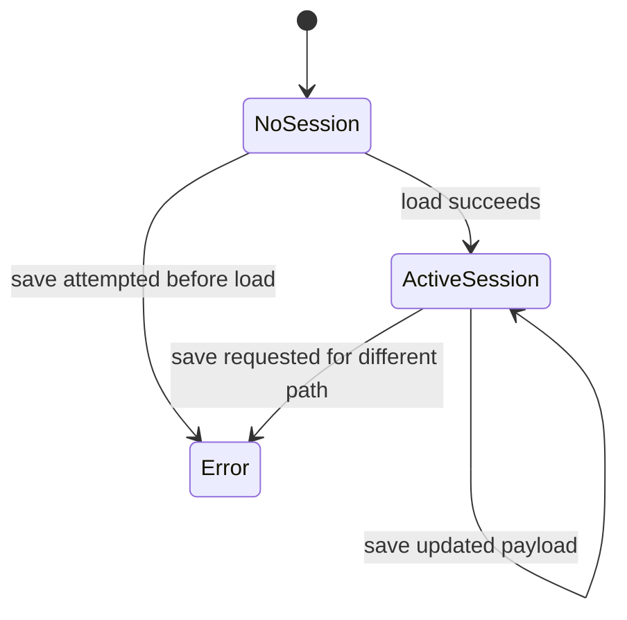
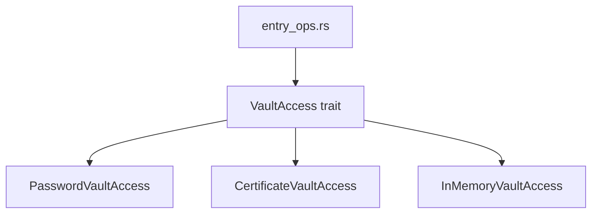

# PasswordOut CAC Architecture Guide

This guide documents the CAC/PIV architecture in PasswordOut, with emphasis on dependency injection, module boundaries, and the files to edit for each behavior.

---

## 1. Purpose

PasswordOut supports certificate-backed vaults where the vault encryption key is wrapped to an X.509 certificate.

For CAC-backed vaults:

- the public certificate comes from PIV slot `9D`
- the matching private key remains on the card
- PasswordOut asks the card to perform the RSA private-key operation
- the application never exports the CAC private key
- a backup password protects a second copy of the same random vault key

The CAC implementation is one backend behind a generic certificate-provider interface.

---

## 2. Quick reference: which file do I edit?

| Goal | Primary file | Related files |
|---|---|---|
| Change CAC reader/card connection logic | `src/smartcard/pcsc.rs` | `src/certificate/cac.rs` |
| Change PIV application selection | `src/smartcard/piv.rs` | `src/certificate/cac.rs` |
| Change CAC slot used for vault unlock | `src/certificate/cac.rs` | `src/vault/format.rs`, `src/smartcard/piv.rs` |
| Change PIN verification | `src/smartcard/piv.rs` | `src/certificate/cac.rs` |
| Change APDU exchange handling | `src/smartcard/apdu.rs` | `src/smartcard/piv.rs` |
| Change TLV parsing | `src/smartcard/tlv.rs` | `src/smartcard/piv.rs`, `src/smartcard/certificate.rs` |
| Change certificate decoding | `src/smartcard/certificate.rs` | `src/certificate/cac.rs` |
| Change CAC RSA private-key operation | `src/smartcard/piv.rs` | `src/certificate/cac.rs`, `src/smartcard/wrapping.rs` |
| Change PKCS#1 v1.5 decoding | `src/smartcard/wrapping.rs` | `src/certificate/cac.rs` |
| Change provider interfaces | `src/certificate/provider.rs` | all certificate backends |
| Change certificate identity matching | `src/certificate/identity.rs` | `src/certificate/service.rs` |
| Change certificate-backed vault creation | `src/vault/service.rs` | `src/vault/format.rs`, `src/certificate/*` |
| Change CAC unlock prompting/selection | `src/vault/commands.rs` | `src/vault/access.rs` |
| Add a new hardware certificate backend | `src/certificate/<backend>.rs` | `provider.rs`, `vault/format.rs`, `vault/service.rs` |
| Test CAC manually | `src/bin/cac_test.rs` | `src/smartcard/*` |
| Test certificate vault behavior manually | `src/bin/cert_test.rs` | `src/certificate/*`, `src/vault/*` |

---

## 3. Architectural layers



The key design rule is:

> Vault code depends on certificate interfaces, not directly on PC/SC, PIV APDUs, or a particular card reader.

---

## 4. Dependency-injection interfaces

The abstraction boundary is in:

```text
src/certificate/provider.rs
```

Conceptually:

```rust
pub trait CertificateSource {
    fn certificate_der(&self) -> Result<Vec<u8>, String>;
}

pub trait CertificatePrivateKey {
    fn unwrap_key(
        &mut self,
        algorithm: KeyWrapAlgorithm,
        wrapped_key: &[u8],
    ) -> Result<Zeroizing<Vec<u8>>, String>;
}

pub trait CertificateKeyProvider:
    CertificateSource + CertificatePrivateKey
{
}
```

### Why the traits are split

Vault initialization needs only the public certificate:

```text
CertificateSource
```

Vault unlock needs:

```text
CertificateSource + CertificatePrivateKey
```

This separation allows:

- initialization from an already-read certificate
- unlock from a live CAC session
- PFX and CAC backends to share the same vault service
- tests to inject a software provider
- vault code to remain independent from native card APIs

### Provider roles

| Interface | Used for |
|---|---|
| `CertificateSource` | obtain DER certificate for wrapping and identity |
| `CertificatePrivateKey` | recover the wrapped vault key |
| `CertificateKeyProvider` | complete unlock-capable provider |

---

## 5. CAC provider types

The CAC adapter is in:

```text
src/certificate/cac.rs
```

It contains two different types because initialization and unlock have different requirements.

### `CacCertificateSource`

Purpose:

- hold a DER certificate already read from slot 9D
- provide only the public certificate
- avoid requiring a PIN or private-key operation during initialization


### `CacKeyProvider`

Purpose:

- connect to a live card
- select the PIV application
- read the slot 9D certificate
- verify the PIN
- retain the open card connection
- perform private-key operations during unlock

The card connection remains owned by the provider for the lifetime of the certificate-vault session.

---

## 6. CAC construction flow



---

## 7. Vault initialization with CAC

The vault service is in:

```text
src/vault/service.rs
```

Initialization takes a generic:

```rust
&dyn CertificateSource
```

It does not know whether the certificate came from:

- CAC
- PFX
- another future certificate backend

### Initialization flow



### Resulting protection

The random vault key has two wrappers:



For CAC backends, the certificate wrapping algorithm is:

```text
RSA PKCS#1 v1.5
```

For PFX backends, the current algorithm is:

```text
RSA OAEP SHA-256
```

---

## 8. CAC unlock flow



---

## 9. Why certificate identity is checked first

The certificate wrapper records an expected certificate identity when the vault is created or rotated.

During unlock:

1. the provider supplies its current certificate
2. PasswordOut compares it with the recorded identity
3. only a matching certificate is allowed to perform unwrap

This catches situations such as:

- wrong CAC inserted
- different card in the same reader
- wrong PFX selected
- certificate replacement without rotation
- mismatched public/private key provider

The identity check is centralized in:

```text
src/certificate/identity.rs
src/certificate/service.rs
```

Do not duplicate identity comparison in CAC-specific code.

---

## 10. Private-key operation path

The CAC private-key operation is implemented in:

```text
src/certificate/cac.rs
```

and delegated to:

```text
src/smartcard/piv.rs
```

Conceptual path:



The private key never leaves the CAC.

The returned RSA block still requires PKCS#1 decoding in:

```text
src/smartcard/wrapping.rs
```

That decoder must reject:

- invalid prefix
- missing separator
- padding shorter than eight bytes
- empty plaintext
- malformed encoded messages

---

## 11. `CertificateVaultAccess` and session ownership

The production access adapter is:

```text
src/vault/access.rs
```

`CertificateVaultAccess<P>` is generic over:

```rust
P: CertificateKeyProvider
```

It owns:

- the provider
- an optional certificate-vault session

### Load

```text
provider + vault path
    -> open_certificate_vault_session
    -> decrypted payload
    -> retained random vault key
    -> retained original wrappers
```

### Save

The save operation:

- requires an active session
- verifies the save path matches the opened path
- re-encrypts the updated payload with the retained vault key
- preserves certificate and backup-password wrappers



This design allows entry operations to use the generic `VaultAccess` trait without knowing whether the vault is password-, PFX-, or CAC-backed.

---

## 12. Test dependency injection

The general entry-operation boundary is:

```text
src/vault/access.rs
```

Trait:

```rust
pub trait VaultAccess {
    fn load(&mut self, path: &Path) -> Result<VaultPayload, String>;
    fn save(&mut self, path: &Path, payload: &VaultPayload)
        -> Result<(), String>;
}
```

Unit tests inject:

```text
InMemoryVaultAccess
```

This enables tests for:

- load count
- save count
- simulated load failure
- simulated save failure
- payload mutation
- no filesystem
- no password prompt
- no CAC
- no PFX
- no native crypto provider



### What is injected where?

| Layer | Injected dependency |
|---|---|
| Entry operations | `&mut dyn VaultAccess` or generic access |
| Certificate unlock service | `&mut dyn CertificateKeyProvider` |
| Certificate initialization | `&dyn CertificateSource` |
| Certificate-vault access | generic provider `P` |
| Unit tests | `InMemoryVaultAccess`, software PFX provider |

### Why PFX is useful in tests

PFX implements the same certificate provider contracts but does not require:

- a card reader
- a CAC
- PIN entry
- PC/SC service
- platform-specific smart-card hardware

That lets tests exercise:

- certificate identity matching
- wrapping/unwrapping
- certificate-vault sessions
- load-modify-save-reopen behavior

Hardware CAC tests remain manual/integration tests.

---

## 13. Smart-card module map

| File | Responsibility |
|---|---|
| `src/smartcard/pcsc.rs` | reader discovery, context, card connection |
| `src/smartcard/apdu.rs` | APDU transmission, `61xx`, `6Cxx`, response chaining |
| `src/smartcard/piv.rs` | PIV selection, PIN verification, objects, RSA operation |
| `src/smartcard/tlv.rs` | BER-TLV parse/encode |
| `src/smartcard/certificate.rs` | extract/decompress DER certificate |
| `src/smartcard/wrapping.rs` | decode card RSA output |
| `src/smartcard/mod.rs` | exports |

---

## 14. Manual CAC testing

Primary tool:

```text
src/bin/cac_test.rs
```

Typical test sequence:

```bash
cargo run --bin cac_test
```

Validate:

1. reader is discovered
2. card connects
3. ATR is displayed or recognized
4. PIV application selects
5. slots 9A, 9C, 9D, and 9E can be read
6. certificate metadata parses
7. slot 9D is suitable for key management
8. PIN verification succeeds
9. RSA operation succeeds
10. wrong PIN produces a clear error
11. removed card produces a clear error
12. wrong card is rejected by identity matching

Never record:

- real PINs
- private certificate data
- decrypted vault keys
- real secrets

---

## 15. Adding another certificate backend

A new backend should follow this pattern.

### Public-certificate-only type

Implement:

```rust
CertificateSource
```

Use for initialization and rotation.

### Unlock-capable provider

Implement:

```rust
CertificateSource
CertificatePrivateKey
```

It then automatically satisfies:

```rust
CertificateKeyProvider
```

### Required updates

```text
src/certificate/<backend>.rs
src/certificate/mod.rs
src/vault/format.rs
src/vault/service.rs
src/vault/commands.rs
```

Potentially also:

```text
src/vault/access.rs
```

if construction/session behavior differs.

### Checklist

- define serialized backend metadata
- define key-wrap algorithm
- validate backend metadata
- derive stable certificate identity
- implement public certificate retrieval
- implement private-key unwrap
- return zeroizing plaintext
- reject unsupported algorithms
- preserve existing backup wrapper
- add software-testable provider tests
- add manual integration test instructions

---

## 16. Failure boundaries

Errors should identify the failing layer without exposing secrets.

Examples:

| Layer | Example error category |
|---|---|
| PC/SC | no reader, no card, card removed |
| PIV | select failed, object missing, PIN failed |
| Certificate | invalid DER, identity mismatch |
| RSA | unsupported algorithm, private operation failed |
| PKCS#1 | malformed encoded message |
| Vault | wrapped key wrong length, decrypt failed |
| Storage | read/write/replace failed |

Do not put the following in error messages:

- PIN
- vault key
- decoded private operation output
- password
- secret
- PFX password

---

## 17. Security invariants

1. The CAC private key never leaves the card.
2. Slot 9D is the key-management slot used for vault key recovery.
3. The provider certificate must match the identity stored in the vault.
4. CAC vaults use the algorithm recorded in the envelope.
5. CAC/PIV currently supports RSA PKCS#1 v1.5 for this flow.
6. Returned plaintext is held in zeroizing containers.
7. The recovered vault key must be exactly 32 bytes.
8. The local vault-key copy is zeroized after use.
9. The backup-password wrapper is created during initialization.
10. Saving a certificate session preserves both wrappers.
11. Vault services must not depend directly on PC/SC.
12. Entry operations must depend on `VaultAccess`, not a concrete unlock backend.

---

## 18. Current extension points

Future improvements may include:

- explicit reader selection instead of first available card
- certificate-slot selection policy
- retry-aware PIN UX
- card-removal detection during long sessions
- chain validation against configured roots
- EKU and key-usage enforcement
- richer certificate identity policy
- mock smart-card transport for APDU integration tests
- platform-native card-selection UI
- support for other hardware certificate providers

Keep these improvements behind the existing provider and smart-card boundaries rather than adding CAC-specific logic to vault encryption code.
