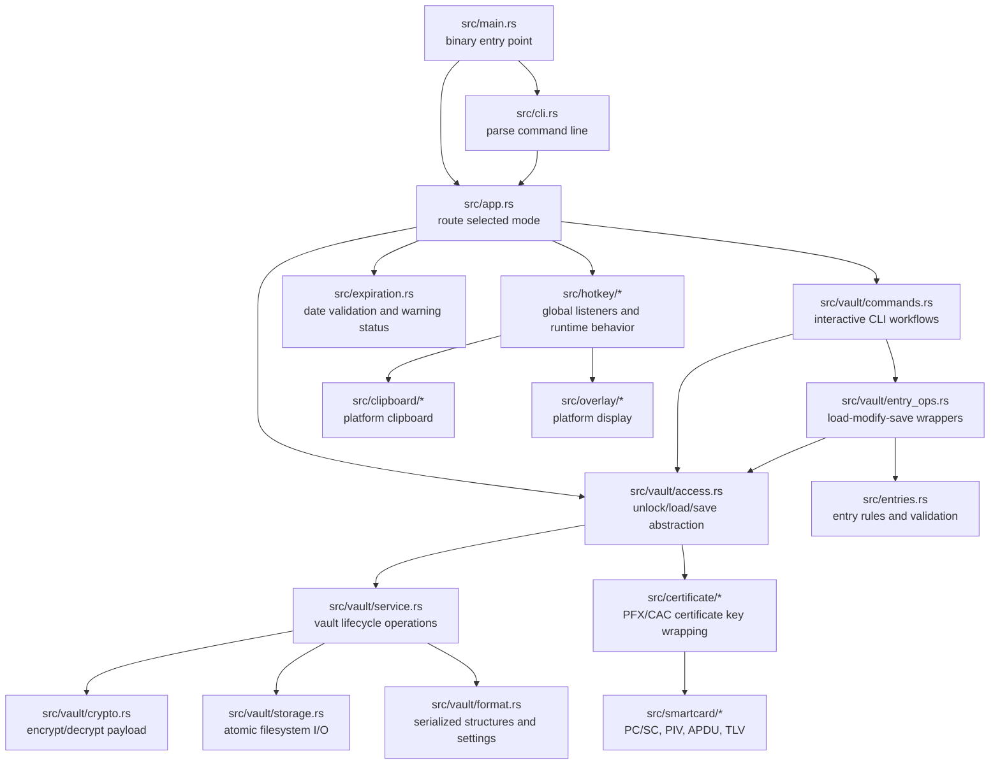
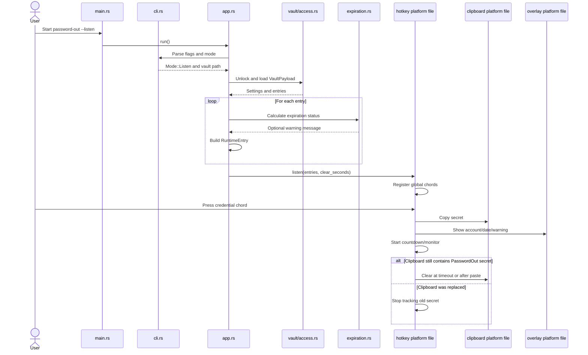
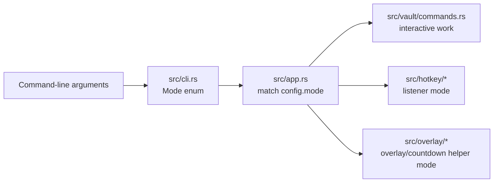
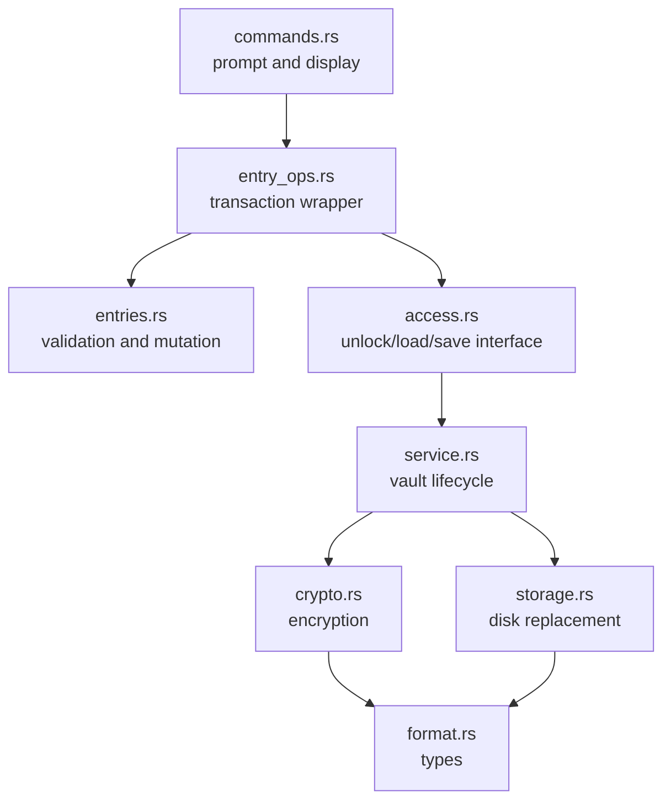
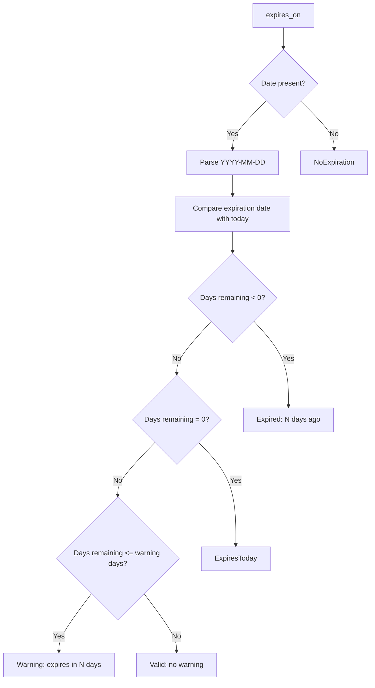
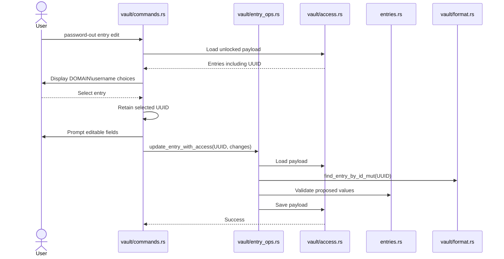

# PasswordOut Developer Guide

This document is a maintainer reference for the PasswordOut Rust codebase.

It is designed to answer two questions quickly:

1. **Which file should I edit for a particular behavior?**
2. **How does data move through PasswordOut at runtime?**

This guide describes the code on `main` after the password-expiration merge.

---

## 1. Quick reference: which file do I edit?

| Goal | Primary file | Related files |
|---|---|---|
| Change the default clipboard timeout | `src/vault/format.rs` | `src/vault/commands.rs`, `src/app.rs` |
| Change the allowed clipboard-timeout range | `src/vault/format.rs` | `src/vault/commands.rs` |
| Change the password-expiration warning window | `src/expiration.rs` | `src/app.rs` |
| Change expiration warning wording | `src/expiration.rs` | `src/hotkey/macos.rs`, `src/hotkey/windows.rs` |
| Change what appears after a password is copied | `src/hotkey/macos.rs` or `src/hotkey/windows.rs` | `src/overlay/*` |
| Change overlay font, size, position, duration, or wrapping | `src/overlay/macos.rs` or `src/overlay/windows.rs` | `src/hotkey/*` |
| Change the entry-list hotkey | `src/hotkey/macos.rs` and `src/hotkey/windows.rs` | none |
| Change the manual clipboard-clear hotkey | `src/hotkey/macos.rs` and Windows equivalent when implemented | `src/clipboard/*` |
| Change hotkey parsing or allowed keys | `src/hotkey/macos.rs` and `src/hotkey/windows.rs` | `src/hotkey/mod.rs` |
| Change clipboard copy or clear behavior | `src/clipboard/macos.rs` or `src/clipboard/windows.rs` | `src/hotkey/*` |
| Change CLI commands or flags | `src/cli.rs` | `src/app.rs`, `src/vault/commands.rs` |
| Change interactive prompts for vault or entries | `src/vault/commands.rs` | `src/vault/entry_ops.rs` |
| Change entry validation or duplicate rules | `src/entries.rs` | `src/expiration.rs`, `src/vault/format.rs` |
| Add or change fields stored in a credential entry | `src/vault/format.rs` | `src/entries.rs`, `src/vault/entry_ops.rs`, tests |
| Change encrypted vault JSON structure | `src/vault/format.rs` | `src/vault/crypto.rs`, `src/vault/service.rs` |
| Change vault encryption/decryption | `src/vault/crypto.rs` | `src/vault/format.rs`, `src/vault/service.rs` |
| Change filesystem save/replace behavior | `src/vault/storage.rs` | `src/vault/service.rs`, `src/vault/access.rs` |
| Change password-unlock behavior | `src/vault/password.rs` | `src/vault/access.rs`, `src/vault/service.rs` |
| Change PFX/certificate unlock behavior | `src/certificate/*` | `src/vault/access.rs`, `src/vault/service.rs` |
| Change CAC/PIV smart-card communication | `src/smartcard/*` | `src/certificate/cac.rs`, `src/bin/cac_test.rs` |
| Add an entry edit command | `src/cli.rs`, `src/vault/commands.rs`, `src/vault/entry_ops.rs` | `src/entries.rs`, `src/vault/format.rs` |
| Change application mode routing | `src/app.rs` | `src/cli.rs` |
| Add a standalone test utility | `src/bin/<name>.rs` | `Cargo.toml` only if explicit configuration is needed |

---

## 2. Important defaults and constants

### Clipboard timeout

The persisted vault setting is:

```rust
VaultSettings {
    clipboard_clear_seconds: u64,
}
```

The constants are in:

```text
src/vault/format.rs
```

Current values:

```rust
pub const DEFAULT_CLIPBOARD_CLEAR_SECONDS: u64 = 30;
pub const MIN_CLIPBOARD_CLEAR_SECONDS: u64 = 1;
pub const MAX_CLIPBOARD_CLEAR_SECONDS: u64 = 120;
```

To change the default for newly created vaults and old vault payloads that do not contain settings, edit:

```rust
pub const DEFAULT_CLIPBOARD_CLEAR_SECONDS: u64 = 30;
```

The runtime selection order is:

1. `--clear-seconds` CLI override, when supplied.
2. `payload.settings.clipboard_clear_seconds` from the vault.
3. `DEFAULT_CLIPBOARD_CLEAR_SECONDS` when a vault payload has no stored settings.

The interactive command for changing the persisted value is implemented in:

```text
src/vault/commands.rs
```

Function:

```rust
run_timeout(...)
```

### Password-expiration warning window

The default warning window is in:

```text
src/expiration.rs
```

Current value:

```rust
pub const DEFAULT_EXPIRATION_WARNING_DAYS: i64 = 14;
```

Change this constant to alter when warning messages begin.

The expiration date remains stored as:

```rust
Option<String>
```

using strict `YYYY-MM-DD` validation.

### Overlay timing and dimensions

macOS values are near the top of:

```text
src/overlay/macos.rs
```

Examples include:

```rust
DISPLAY_DURATION
SINGLE_LINE_FONT_SIZE
MULTILINE_FONT_SIZE
MULTILINE_LINE_HEIGHT
SCREEN_MARGIN
TOP_MARGIN
```

Windows values are near the top of:

```text
src/overlay/windows.rs
```

Examples include:

```rust
MAX_FONT_SIZE
MIN_FONT_SIZE
HORIZONTAL_PADDING
VERTICAL_PADDING
SINGLE_LINE_DURATION_MS
MULTILINE_DURATION_MS
```

### Built-in hotkeys

Platform hotkey constants live in:

```text
src/hotkey/macos.rs
src/hotkey/windows.rs
```

Examples:

```rust
LIST_HOTKEY
CLEAR_HOTKEY
```

Keep reserved-hotkey validation synchronized with any constant changes.

---

## 3. High-level architecture



---

## 4. Runtime listener flow

When PasswordOut starts with `--listen`, the main runtime path is:



### RuntimeEntry

The platform listener receives a non-persisted structure from:

```text
src/hotkey/mod.rs
```

It contains runtime-ready information such as:

```rust
pub struct RuntimeEntry {
    pub account: String,
    pub hotkey: String,
    pub secret: String,
    pub expires_on: Option<String>,
    pub expiration_warning: Option<String>,
}
```

`account` is formatted as:

```text
DOMAIN\username
```

Expiration status is calculated once during listener startup. Restart the listener after changing an entry or its expiration date.

---

## 5. CLI routing

The command path is deliberately split into three levels.



### `src/main.rs`

Minimal process entry point.

Responsibilities:

- Declare binary modules.
- Call `app::run()`.
- Print a top-level error.
- Exit nonzero on failure.

Avoid putting business logic here.

### `src/cli.rs`

Defines:

- CLI flags.
- Subcommands.
- `Mode`.
- `Config`.
- Compatibility and conflict checks.

Edit this file when adding a command such as:

```text
password-out entry edit
```

A new command generally requires:

1. A new Clap command variant.
2. A new `Mode` variant.
3. A mapping in `parse_from`.
4. A match arm in `src/app.rs`.

### `src/app.rs`

The central application router.

Responsibilities:

- Parse arguments.
- Load the vault for listener mode.
- Resolve clipboard timeout.
- Calculate expiration warnings.
- Convert persistent `VaultEntry` values into `RuntimeEntry` values.
- Route vault and entry commands.
- Route overlay helper modes.

Avoid placing detailed interactive prompts or platform UI code here.

---

## 6. Vault model and storage

### Vault structure

The main persistent structures live in:

```text
src/vault/format.rs
```

Simplified payload:

```rust
pub struct VaultPayload {
    pub settings: VaultSettings,
    pub entries: Vec<VaultEntry>,
}
```

Simplified entry:

```rust
pub struct VaultEntry {
    pub id: Uuid,
    pub domain: String,
    pub username: String,
    pub hotkey: String,
    pub secret: String,
    pub expires_on: Option<String>,
}
```

### Entry identity

PasswordOut uses two kinds of identity:

- Human-facing key: case-insensitive `domain + username`.
- Internal key: immutable UUID.

The UUID exists so an entry can eventually be edited even when domain, username, or hotkey changes.

Current helper:

```rust
find_entry_by_id(...)
```

The method is intentionally present for the future edit implementation. A mutable companion will likely be needed:

```rust
pub fn find_entry_by_id_mut(&mut self, id: Uuid) -> Option<&mut VaultEntry> {
    self.entries.iter_mut().find(|entry| entry.id == id)
}
```

### Legacy compatibility

Older entries may deserialize with:

- `name` mapped to `username`.
- missing `domain` mapped to `"domain"`.
- missing UUID mapped to the nil UUID.
- missing expiration mapped to `None`.
- missing settings mapped to defaults.

When changing serialized fields:

1. Add safe Serde defaults or aliases.
2. Add compatibility tests.
3. Avoid silently changing cryptographic envelope meaning.
4. Consider whether old data needs a persisted migration.

### Vault envelope and unlock methods

`src/vault/format.rs` also defines versioned encrypted-envelope structures and unlock metadata.

Do not casually change:

- format version constants
- KDF algorithm names
- cipher algorithm names
- certificate wrapper fields
- CAC slot values
- serialized enum shapes

Any such change needs compatibility tests and a migration plan.

---

## 7. Vault operation layers

PasswordOut separates vault work into layers.



### `src/vault/commands.rs`

Human-facing interactive behavior.

Contains workflows such as:

- vault initialization
- vault recovery
- certificate rotation
- vault information
- timeout configuration
- entry add
- entry list
- entry remove

Edit this file for prompts, confirmation text, selection menus, and output columns.

Do not implement encryption directly here.

### `src/vault/entry_ops.rs`

Coordinates:

1. load
2. modify or inspect
3. save

This layer makes entry operations testable through injected vault access.

Edit this file when adding a transaction such as `edit_entry_with_access`.

### `src/entries.rs`

Pure entry-domain rules.

Responsibilities include:

- nonempty domain
- nonempty username
- hotkey validation
- nonempty secret
- expiration-date validation
- unique case-insensitive `domain + username`
- unique case-insensitive hotkey
- UUID generation
- sorting
- removal
- metadata listing

Keep this file independent of terminal prompting and filesystem access.

### `src/vault/access.rs`

Provides the access boundary used by commands and operations.

Responsibilities include:

- selecting the unlock backend
- loading payloads
- saving payloads
- allowing in-memory test implementations

This is the preferred seam for unit tests that must simulate load/save failures.

### `src/vault/service.rs`

Implements higher-level vault lifecycle behavior:

- initialization
- open/load
- save
- backup recovery
- certificate rotation
- compatibility helpers

This file coordinates crypto, format, storage, and certificate providers.

### `src/vault/crypto.rs`

Cryptographic payload operations.

Responsibilities include:

- password-based wrapping
- encrypting/decrypting vault payloads
- integrity failure handling
- version-specific crypto behavior

Never log secret plaintext, derived keys, vault keys, PFX passwords, or decrypted payload JSON.

### `src/vault/storage.rs`

Filesystem persistence.

Responsibilities include:

- reading envelopes
- writing temporary files
- replacing existing vaults
- cleanup after failed replacement
- avoiding partial writes

Maintain atomic-replacement behavior when changing this code.

### `src/vault/password.rs`

Interactive password prompting and password-specific helpers.

Keep terminal password handling isolated here rather than spreading it across commands.

---

## 8. Password expiration

Expiration logic is intentionally centralized in:

```text
src/expiration.rs
```

It defines:

```rust
ExpirationStatus
parse_expiration_date(...)
validate_expiration_date(...)
expiration_status(...)
current_expiration_status(...)
warning_message(...)
```

### Status rules



### Where expiration is used

- Validation on add: `src/entries.rs`
- Runtime calculation: `src/app.rs`
- macOS text: `src/hotkey/macos.rs`
- Windows text: `src/hotkey/windows.rs`
- Overlay rendering: `src/overlay/macos.rs`, `src/overlay/windows.rs`
- Persisted field: `src/vault/format.rs`
- Interactive prompt/list display: `src/vault/commands.rs`

### Testing expiration changes

Use fixed dates in unit tests by calling:

```rust
expiration_status(expires_on, today, warning_days)
```

Do not make most tests depend on the real clock. Only the runtime wrapper should call the current date.

---

## 9. Hotkey layer

### `src/hotkey/mod.rs`

Shared platform boundary.

Defines `RuntimeEntry` and conditionally exports the active platform implementation.

### `src/hotkey/macos.rs`

macOS responsibilities:

- canonicalize and parse chords
- capture and test hotkeys
- register global hotkeys
- map hotkey IDs to runtime entries
- copy secrets
- spawn overlay helpers
- spawn countdown helpers
- monitor clipboard replacement
- clear only the active PasswordOut secret
- list entries through a reserved chord
- debounce repeated hotkey events

### `src/hotkey/windows.rs`

Windows responsibilities mirror macOS, using Win32 APIs:

- `RegisterHotKey`
- Windows message loop
- virtual-key parsing
- hotkey availability tests
- clipboard/paste monitoring
- overlay helper spawning
- countdown helper spawning

### Message construction versus rendering

These are separate concerns:

- `src/hotkey/*` decides **what text** to display.
- `src/overlay/*` decides **how that text** is rendered.

For example, when a third expiration-warning line is missing entirely, inspect `src/hotkey/windows.rs`.

When the third line exists but is clipped, inspect `src/overlay/windows.rs`.

---

## 10. Clipboard layer

```text
src/clipboard/mod.rs
src/clipboard/macos.rs
src/clipboard/windows.rs
```

The shared interface provides operations such as:

```rust
copy_to_clipboard(...)
current_text(...)
clear_if_matches(...)
```

The critical safety rule is:

> Clear the clipboard only when its current content still matches the secret PasswordOut placed there.

The hotkey layer owns the active-secret generation and timer state. The clipboard layer performs platform operations.

When modifying clipboard behavior, test:

- timeout clear
- manual clear
- user replaces clipboard before timeout
- user triggers a second credential before the first expires
- paste-triggered clear on supported platforms
- clipboard API failure
- countdown helper termination

---

## 11. Overlay layer

```text
src/overlay/mod.rs
src/overlay/macos.rs
src/overlay/windows.rs
```

The overlay must never receive or display the secret itself.

### macOS

Uses Cocoa/AppKit.

Major responsibilities:

- nonactivating panel
- transparent background
- dynamic single-line sizing
- multiline sizing and wrapping
- top-center message placement
- bottom-left countdown placement
- persistent helper mode for the held entry list
- timed process exit for transient messages

### Windows

Uses Win32 windowing and GDI.

Major responsibilities:

- transparent layered topmost window
- dynamic font selection
- text measurement
- multiline word wrapping
- timer-driven destruction
- countdown repaint
- no-activation behavior

### Overlay helper process

The listener launches the current executable with internal flags such as:

```text
--overlay
--countdown
```

That keeps the platform UI event loop out of the listener process.

When changing internal helper flags, update both:

- `src/cli.rs`
- the helper-spawning code in `src/hotkey/*`

---

## 12. Certificate and smart-card layers

### Certificate modules

```text
src/certificate/cac.rs
src/certificate/identity.rs
src/certificate/key_wrap.rs
src/certificate/mod.rs
src/certificate/pfx.rs
src/certificate/provider.rs
src/certificate/self_signed.rs
src/certificate/service.rs
```

General responsibilities:

| File | Purpose |
|---|---|
| `provider.rs` | Common certificate-provider abstraction |
| `identity.rs` | Extract and compare certificate identity |
| `key_wrap.rs` | RSA wrapping/unwrapping primitives |
| `pfx.rs` | PFX-backed certificate provider |
| `cac.rs` | CAC-backed certificate provider |
| `self_signed.rs` | Generate/load development PFX material |
| `service.rs` | Coordinate certificate matching and vault-key operations |
| `mod.rs` | Module exports |

### Smart-card modules

```text
src/smartcard/apdu.rs
src/smartcard/certificate.rs
src/smartcard/mod.rs
src/smartcard/pcsc.rs
src/smartcard/piv.rs
src/smartcard/tlv.rs
src/smartcard/wrapping.rs
```

General responsibilities:

| File | Purpose |
|---|---|
| `pcsc.rs` | Reader discovery, card connection, PC/SC transport |
| `apdu.rs` | Complete APDU exchange handling |
| `piv.rs` | PIV application, slots, objects, authentication operations |
| `tlv.rs` | BER-TLV parsing/encoding |
| `certificate.rs` | Certificate extraction and metadata |
| `wrapping.rs` | Smart-card key wrapping/unwrapping support |
| `mod.rs` | Module exports |

Keep raw smart-card transport separate from vault policy and CLI prompts.

---

## 13. Test binaries

```text
src/bin/cac_test.rs
src/bin/cert_test.rs
src/bin/countdown-test.rs
```

### `cac_test.rs`

Manual CAC/PIV exploration:

- list readers
- connect to a card
- inspect slots/certificates
- exercise smart-card operations

### `cert_test.rs`

Manual certificate-vault testing:

- PFX/certificate operations
- vault open behavior
- entry metadata display
- certificate rotation/recovery experiments

### `countdown-test.rs`

Runs the countdown overlay independently from the listener.

Useful for UI work:

```bash
cargo run --bin countdown-test
```

Keep test binaries free of real credentials and private certificate material.

---

## 14. Library and module roots

### `src/lib.rs`

Public library root.

Exports reusable modules for tests and secondary binaries.

### `src/vault_core.rs`

Library-facing vault module root.

It allows the library to expose the vault implementation while the binary continues to use its local module layout.

### `src/vault/mod.rs`

Binary-side vault module root and public re-exports.

### Why some tests run twice

Both the library target and main binary may compile overlapping modules.

That is why `cargo test` can show:

- library tests
- main-binary tests
- tests for each `src/bin/*`
- documentation tests

This is expected with the current module arrangement.

---

## 15. Adding `entry edit`

The UUID support was introduced for this feature.

Recommended flow:



Suggested implementation locations:

1. `src/cli.rs`
   - Add `EntryCommand::Edit`.
   - Add `Mode::EntryEdit`.

2. `src/app.rs`
   - Route `Mode::EntryEdit` to `vault::run_edit`.

3. `src/vault/commands.rs`
   - Present non-secret metadata.
   - Store the selected UUID.
   - Prompt for new values.
   - Allow Enter to retain existing values.
   - Never print the existing secret.

4. `src/vault/entry_ops.rs`
   - Add `edit_entry_with_access`.

5. `src/entries.rs`
   - Add validation/mutation logic.
   - Check domain/username uniqueness while excluding the edited UUID.
   - Check hotkey uniqueness while excluding the edited UUID.

6. `src/vault/format.rs`
   - Add `find_entry_by_id_mut`.

7. Tests
   - UUID remains unchanged.
   - Domain/username can change.
   - Expiration can be added, replaced, or cleared.
   - Secret can remain unchanged.
   - Duplicate account and hotkey checks exclude the same entry but reject other entries.
   - Failed validation does not save.
   - Failed save returns an error.

---

## 16. Common change recipes

### Change the default clipboard timeout to 20 seconds

Edit:

```text
src/vault/format.rs
```

Change:

```rust
pub const DEFAULT_CLIPBOARD_CLEAR_SECONDS: u64 = 30;
```

to:

```rust
pub const DEFAULT_CLIPBOARD_CLEAR_SECONDS: u64 = 20;
```

Important: existing vaults that already store a timeout retain their stored value. Use:

```bash
cargo run -- vault timeout
```

to update an existing vault.

### Change expiration warnings from 14 days to 30 days

Edit:

```text
src/expiration.rs
```

Change:

```rust
pub const DEFAULT_EXPIRATION_WARNING_DAYS: i64 = 14;
```

to:

```rust
pub const DEFAULT_EXPIRATION_WARNING_DAYS: i64 = 30;
```

Restart the listener because warnings are calculated during startup.

### Change the overlay display duration

macOS:

```text
src/overlay/macos.rs
```

Windows:

```text
src/overlay/windows.rs
```

Do not change hotkey files merely to keep the overlay visible longer.

### Change overlay wording

Credential copy text:

```text
src/hotkey/macos.rs
src/hotkey/windows.rs
```

Expiration status wording:

```text
src/expiration.rs
```

Vault CLI output:

```text
src/vault/commands.rs
```

### Add a field to every entry

Update at least:

```text
src/vault/format.rs
src/entries.rs
src/vault/entry_ops.rs
src/vault/commands.rs
src/app.rs              # when required at runtime
src/hotkey/*            # when displayed or used by listeners
src/bin/cert_test.rs     # when metadata output is affected
```

Also update test fixtures in:

```text
src/vault/access.rs
src/vault/crypto.rs
src/vault/service.rs
```

Use a Serde default when old vaults must remain readable.

### Add a platform-specific feature

Shared API:

```text
src/<feature>/mod.rs
```

Platform implementations:

```text
src/<feature>/macos.rs
src/<feature>/windows.rs
```

Use `#[cfg(target_os = "...")]` in the module root. Keep native API calls out of shared vault and entry logic.

---

## 17. Development workflow

### Before editing

```bash
git switch main
git pull --ff-only origin main

git switch -c feature-name
```

### During development

```bash
cargo fmt
cargo check
cargo test
```

For a Windows target from another host:

```bash
cargo check \
  --target x86_64-pc-windows-gnu
```

### Before committing

```bash
cargo fmt --check
cargo test
git diff --check
git status --short
```

Review source changes:

```bash
git diff
```

### Commit and merge

```bash
git add <changed-files>

git commit -m "Describe the change"

git push -u origin feature-name

git switch main
git pull --ff-only origin main

git merge --no-ff feature-name \
  -m "Merge feature-name"

cargo test

git push origin main
```

---

## 18. Test strategy

### Pure logic tests

Best locations:

```text
src/entries.rs
src/expiration.rs
src/vault/format.rs
src/vault/crypto.rs
```

Use these for deterministic behavior without terminal, filesystem, or OS UI dependencies.

### Access and failure-path tests

Best locations:

```text
src/vault/access.rs
src/vault/entry_ops.rs
```

Test:

- load failure
- save failure
- no save after failed validation
- exact load/save counts
- secret metadata not leaked through list operations

### Storage tests

Best location:

```text
src/vault/storage.rs
```

Test:

- temporary paths are unique
- successful replacement
- failed replacement preserves original
- temporary files are cleaned up

### Manual platform tests

Required for:

- global hotkey registration
- overlay sizing
- clipboard replacement monitoring
- paste detection
- countdown position
- multiple monitors
- high-DPI Windows displays
- macOS Spaces and fullscreen applications
- CAC reader/card behavior

Unit tests cannot fully validate native window-manager and clipboard behavior.

---

## 19. Security rules for changes

1. Never display or log `entry.secret`.
2. Never include real secrets in test fixtures or documentation.
3. Keep clipboard exposure time bounded.
4. Clear only when clipboard content still matches the PasswordOut secret.
5. Stop old timers/countdowns when a newer secret becomes active.
6. Keep overlay messages non-secret.
7. Preserve atomic vault replacement.
8. Preserve vault-format backward compatibility unless a deliberate migration is implemented.
9. Validate all user-controlled dates, hotkeys, paths, and serialized metadata.
10. Treat certificate private keys, PFX passwords, CAC PINs, and unwrapped vault keys as sensitive.
11. Avoid putting secret-bearing values in error messages.
12. Keep platform `unsafe` code narrow and reviewable.

---

## 20. Current maintenance notes

- `find_entry_by_id()` is expected to remain unused until entry editing is implemented.
- Legacy entries can deserialize with a nil UUID; a complete persisted UUID migration is still a future improvement.
- Expiration warnings are calculated at listener startup, not on every hotkey press.
- The default warning period is currently a source constant, not a persisted vault setting.
- The clipboard timeout can be overridden temporarily by CLI or stored in the vault.
- macOS and Windows implementations must be kept behaviorally aligned.
- UI text generation belongs in `hotkey/*`; native rendering belongs in `overlay/*`.
- The repository contains both library and binary module roots, so some tests appear in more than one test target.
- The `block` crate future-compatibility warning comes from a dependency and is separate from PasswordOut application logic.

---

## 21. Source tree summary

```text
src/
├── app.rs
├── cli.rs
├── entries.rs
├── expiration.rs
├── lib.rs
├── main.rs
├── vault_core.rs
│
├── bin/
│   ├── cac_test.rs
│   ├── cert_test.rs
│   └── countdown-test.rs
│
├── certificate/
│   ├── cac.rs
│   ├── identity.rs
│   ├── key_wrap.rs
│   ├── mod.rs
│   ├── pfx.rs
│   ├── provider.rs
│   ├── self_signed.rs
│   └── service.rs
│
├── clipboard/
│   ├── macos.rs
│   ├── mod.rs
│   └── windows.rs
│
├── hotkey/
│   ├── macos.rs
│   ├── mod.rs
│   └── windows.rs
│
├── overlay/
│   ├── macos.rs
│   ├── mod.rs
│   └── windows.rs
│
├── smartcard/
│   ├── apdu.rs
│   ├── certificate.rs
│   ├── mod.rs
│   ├── pcsc.rs
│   ├── piv.rs
│   ├── tlv.rs
│   └── wrapping.rs
│
└── vault/
    ├── access.rs
    ├── commands.rs
    ├── crypto.rs
    ├── entry_ops.rs
    ├── format.rs
    ├── mod.rs
    ├── password.rs
    ├── service.rs
    └── storage.rs
```

---

## 22. Keeping this guide current

Update this document whenever a change:

- adds or removes a source file
- moves a constant
- introduces a new CLI command
- changes a persistent structure
- changes runtime ownership between modules
- adds a platform backend
- adds a vault unlock method
- changes the clipboard lifecycle
- adds a major manual test workflow

A useful maintenance check is:

```bash
find src \
  -type f \
  -name '*.rs' \
  -print |
sort
```

Compare that list with the source-tree summary and quick-reference table above.
