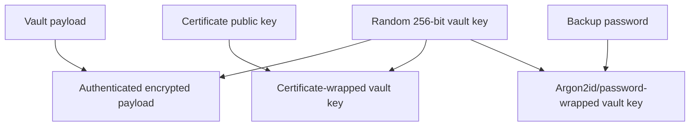
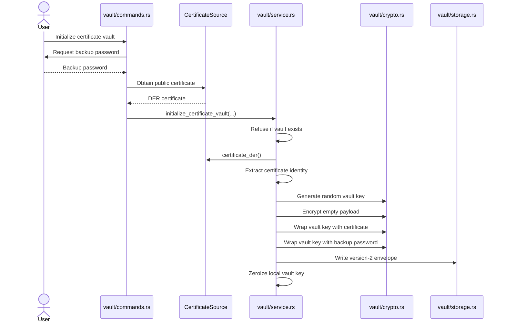
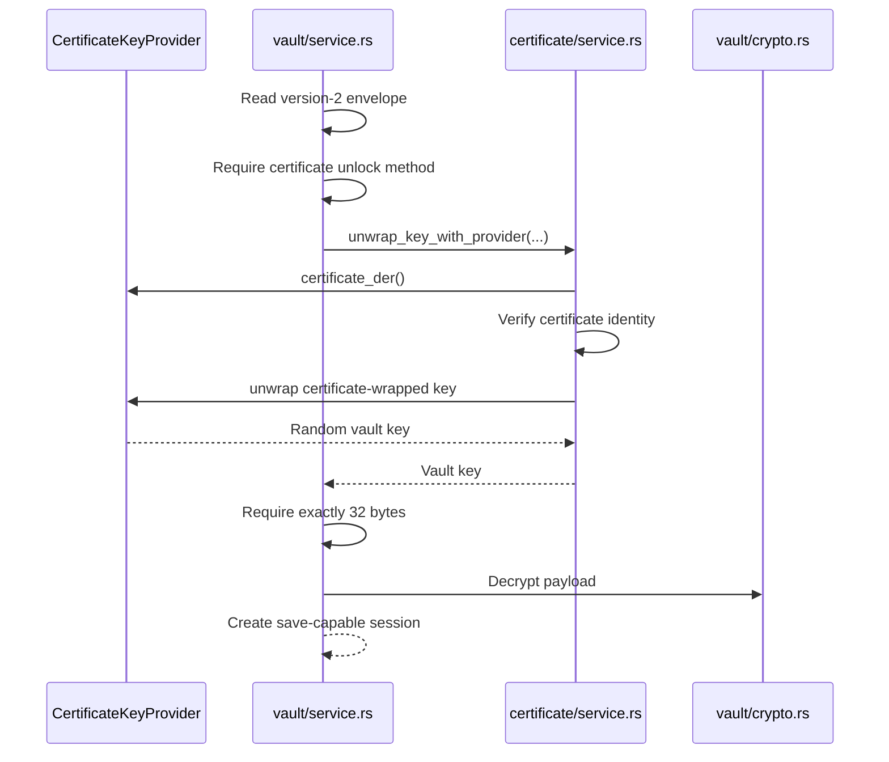
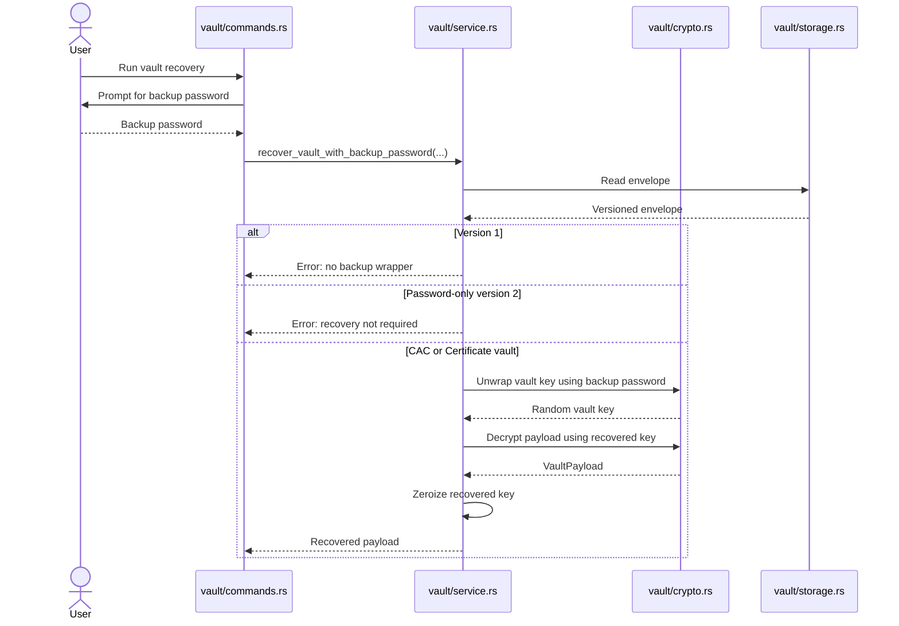
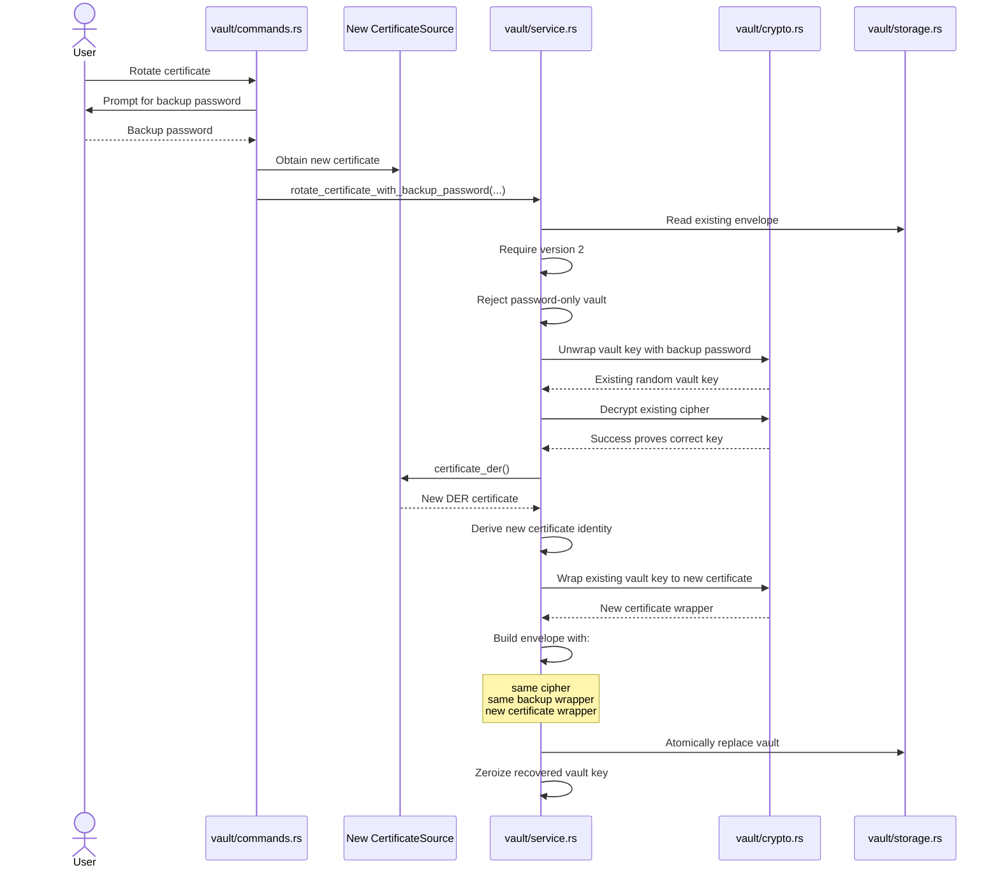
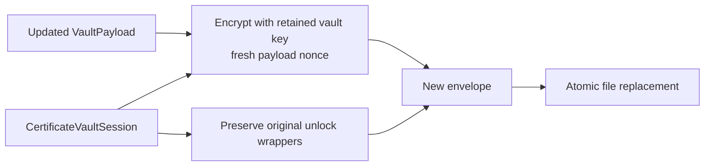
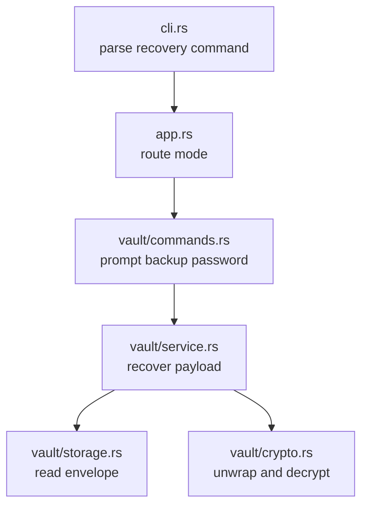
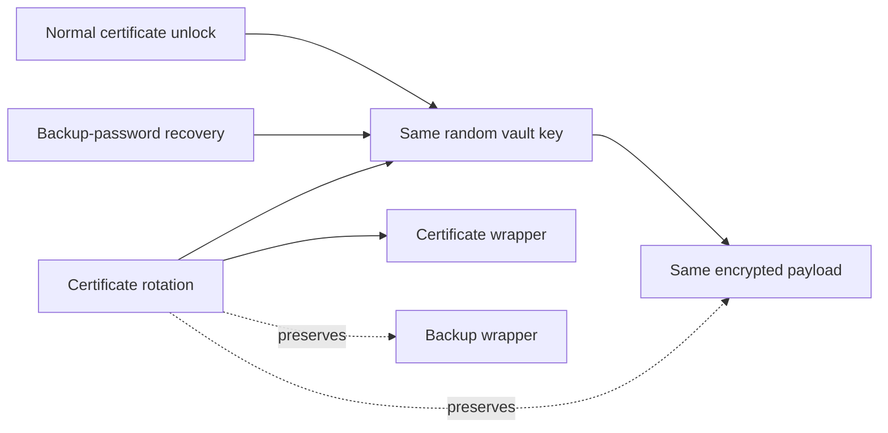

# PasswordOut Vault Recovery Architecture

This guide documents how PasswordOut backup-password recovery and certificate rotation work, which files own each responsibility, and the invariants that must be preserved.

---

## 1. Recovery model

PasswordOut certificate-backed vaults use one random vault key to encrypt the payload.

That vault key is protected twice:

1. certificate wrapper
2. backup-password wrapper



Recovery does not decrypt the vault with the backup password directly.

Instead, the backup password recovers the same random vault key that the certificate normally recovers.

---

## 2. Quick reference: which file do I edit?

| Goal | Primary file | Related files |
|---|---|---|
| Change recovery algorithm | `src/vault/service.rs` | `src/vault/crypto.rs`, `src/vault/format.rs` |
| Change backup-password wrapping | `src/vault/crypto.rs` | `src/vault/format.rs` |
| Change recovery command prompts | `src/vault/commands.rs` | `src/cli.rs`, `src/app.rs` |
| Change envelope fields | `src/vault/format.rs` | `src/vault/service.rs`, compatibility tests |
| Change certificate rotation | `src/vault/service.rs` | `src/certificate/*`, `src/vault/commands.rs` |
| Change atomic write behavior | `src/vault/storage.rs` | `src/vault/service.rs` |
| Change CLI command routing | `src/cli.rs`, `src/app.rs` | `src/vault/commands.rs` |
| Add recovery audit output | `src/vault/commands.rs` | do not expose secrets |
| Test recovery | `src/vault/service.rs` tests | `src/bin/cert_test.rs` |
| Add a new recovery method | `src/vault/format.rs`, `src/vault/service.rs` | `src/vault/commands.rs`, tests |

---

## 3. Relevant files

| File | Responsibility |
|---|---|
| `src/vault/format.rs` | versioned envelope, unlock variants, wrappers |
| `src/vault/crypto.rs` | vault-key generation, payload encryption, password wrapping |
| `src/vault/service.rs` | initialize, recover, rotate, open, save |
| `src/vault/storage.rs` | read and atomically replace vault file |
| `src/vault/commands.rs` | user prompts and recovery command |
| `src/cli.rs` | recovery and rotation command parsing |
| `src/app.rs` | command routing |
| `src/certificate/provider.rs` | certificate source/provider abstractions |
| `src/certificate/service.rs` | certificate identity check and unwrap |
| `src/bin/cert_test.rs` | manual certificate-vault tests |

---

## 4. Envelope structure

Conceptually, a version-2 certificate vault contains:

```text
VaultEnvelopeV2
├── version
├── unlock
│   └── Certificate
│       ├── certificate_wrapper
│       │   ├── backend metadata
│       │   ├── certificate identity
│       │   ├── key-wrap algorithm
│       │   └── wrapped vault key
│       └── backup_wrapper
│           ├── KDF parameters
│           ├── salt
│           ├── nonce or wrapper metadata
│           └── password-wrapped vault key
└── cipher
    ├── encrypted payload
    ├── nonce
    └── authenticated-encryption metadata
```

The encrypted payload is independent from either unlock wrapper.

That separation allows certificate rotation without decrypting and re-encrypting every credential.

---

## 5. Initialization flow



### Initialization invariants

- vault path must not already exist
- backend metadata must validate
- certificate must parse
- random vault key must be generated securely
- both wrappers must protect the same vault key
- payload encryption must use the random vault key
- vault key must be zeroized after envelope creation
- write must be atomic

---

## 6. Normal certificate unlock



A successful session retains:

- version
- original unlock structure
- recovered vault key

The vault key is held in a zeroizing container.

---

## 7. Backup-password recovery

Function:

```text
recover_vault_with_backup_password(...)
```

Location:

```text
src/vault/service.rs
```

### Recovery flow



### Important behavior

Recovery:

- reads the vault
- unwraps the existing vault key
- decrypts the existing payload
- returns the payload
- does not modify the vault file
- does not replace the certificate wrapper
- does not replace the backup wrapper

This is a read/recovery operation, not automatic certificate repair.

---

## 8. Recovery versus rotation

| Operation | Recovers payload? | Changes certificate wrapper? | Changes backup wrapper? | Changes encrypted payload? |
|---|---:|---:|---:|---:|
| Normal certificate unlock | yes | no | no | no |
| Backup-password recovery | yes | no | no | no |
| Certificate rotation | validates/decrypts | yes | no | no |
| Save after certificate unlock | yes | no | no | yes, fresh payload nonce |
| Password-vault save | yes | n/a | password wrapper recreated | yes |

Recovery proves the backup password can recover the vault key.

Rotation uses that recovered key to create a new certificate wrapper.

---

## 9. Certificate rotation

Function:

```text
rotate_certificate_with_backup_password(...)
```

Location:

```text
src/vault/service.rs
```

Purpose:

- recover the existing random vault key using the backup password
- verify that key actually decrypts the payload
- wrap the same key to a new certificate
- preserve the backup wrapper
- preserve the encrypted payload

### Rotation flow



### Rotation invariants

Certificate rotation must preserve:

```text
cipher
backup_wrapper
version
```

It replaces:

```text
certificate_wrapper
```

That means credential ciphertext does not need to be regenerated during certificate rotation.

---

## 10. Why decryption is verified before rotation

The service decrypts the payload before replacing the certificate wrapper.

This prevents a dangerous case:

1. wrong backup password or malformed wrapper produces incorrect key material
2. new certificate wrapper is written around bad key material
3. vault becomes unrecoverable

The verification step proves the recovered key is the actual key for the current cipher before any write occurs.

---

## 11. Save behavior after normal certificate unlock

A certificate-backed load returns a:

```text
CertificateVaultSession
```

The session retains:

- original unlock wrappers
- random vault key
- format version

When entries are changed:



The certificate private-key operation is not repeated for each save.

---

## 12. Recovery command architecture



### Prompt layer

`src/vault/commands.rs` should own:

- backup-password prompt
- confirmation and user-readable messages
- backend selection for rotation
- certificate/PFX/CAC source construction

It should not own:

- key unwrap algorithms
- envelope matching
- payload decryption
- file replacement

---

## 13. Failure cases

### Version 1 vault

Recovery fails because version 1 does not contain a backup wrapper.

Expected category:

```text
version-1 vaults do not contain a backup-password wrapper
```

### Password-only vault

Recovery is rejected because normal master-password unlock is the correct path.

Expected category:

```text
this vault uses normal password protection and does not require recovery
```

### Wrong backup password

Password wrapper authentication or subsequent decrypt fails.

The vault file must remain unchanged.

### Corrupt backup wrapper

Unwrap fails before rotation or payload recovery.

The vault file must remain unchanged.

### Corrupt cipher

The key may unwrap, but payload decryption fails.

Rotation must not write a new wrapper.

### Wrong new certificate

Rotation can still wrap to any valid new certificate source, but future unlock requires its matching private key. The CLI must ensure the operator selected the intended new certificate.

### Storage failure

Atomic replacement must preserve the original vault and remove temporary files where possible.

---

## 14. Tests to maintain

Primary recovery and rotation tests belong in:

```text
src/vault/service.rs
```

Important cases:

- backup password recovers certificate vault
- wrong backup password fails
- password vault rejects recovery
- version-1 vault rejects recovery
- certificate rotation preserves cipher
- certificate rotation preserves backup wrapper
- certificate rotation replaces certificate identity
- rotated vault opens with new provider
- rotated vault rejects old provider
- failed decrypt prevents rotation write
- failed replacement preserves original vault
- recovered vault key is zeroized
- PFX and CAC backend algorithms remain correct

Storage guarantees belong in:

```text
src/vault/storage.rs
```

Test:

- original survives failed replacement
- temporary files are removed
- successful replacement leaves no temp file
- temporary paths are unique

---

## 15. Manual recovery test

Use only disposable test data.

### Create a certificate-backed test vault

Use the normal certificate-vault initialization flow with:

- test PFX or test CAC
- known backup password
- test-only credentials

### Confirm normal unlock

Open the vault with its certificate provider.

### Confirm recovery

Temporarily make the original certificate unavailable, then run the recovery command with the backup password.

Expected:

- payload decrypts
- entry metadata can be read
- original vault file is unchanged

### Confirm wrong password rejection

Use a wrong backup password.

Expected:

- clear failure
- no file modification
- no temporary replacement left behind

### Rotate

Provide:

- correct backup password
- new PFX or CAC certificate source

Expected:

- rotation succeeds
- new certificate opens vault
- old certificate no longer opens vault
- same backup password still recovers vault
- entries and settings remain unchanged

---

## 16. Inspecting preservation during rotation

For test code, compare envelope fields before and after rotation.

Expected:

```text
before.cipher == after.cipher
before.backup_wrapper == after.backup_wrapper
before.certificate_wrapper != after.certificate_wrapper
```

Do not print wrapper secrets or key material in production logs.

A test may compare serialized structures or selected non-secret fields.

---

## 17. Adding another recovery mechanism

A new recovery method requires careful format design.

Potential examples:

- recovery key file
- second certificate
- hardware recovery token
- split-key recovery
- enterprise escrow provider

Required design questions:

1. Does it wrap the same random vault key?
2. Is it additive or does it replace the backup wrapper?
3. How is it represented in `VaultUnlockMethod`?
4. Can old versions ignore or migrate it safely?
5. How is authentication verified before write?
6. How is key material zeroized?
7. What happens when one recovery method is lost?
8. Does rotation preserve all recovery wrappers?
9. Can it be tested without production hardware?
10. What is the rollback behavior after a failed write?

Do not add a recovery mechanism only in the CLI. It must be represented and validated in the versioned envelope.

---

## 18. Security invariants

1. Recovery unwraps the existing random vault key.
2. Recovery does not rewrite the vault.
3. Rotation verifies decryption before writing.
4. Rotation preserves the existing cipher.
5. Rotation preserves the backup wrapper.
6. Rotation replaces only the certificate wrapper and its metadata.
7. Recovered keys are zeroized.
8. Wrong passwords never cause a write.
9. Password-only vaults do not use certificate recovery.
10. Version-1 vaults do not pretend to have backup recovery.
11. File replacement remains atomic.
12. Recovery output never displays secrets.
13. Backup passwords are never logged.
14. Wrapped or unwrapped vault keys are never logged.
15. Certificate identity changes only through explicit rotation.

---

## 19. Operational guidance

The backup password is a true recovery credential.

Operators should:

- store it separately from the CAC/PFX
- avoid storing it in the same vault
- use a strong unique value
- test recovery before relying on the vault
- retest after certificate rotation
- keep at least one verified backup of the encrypted vault file
- document which certificate currently protects the vault
- never assume certificate rotation changes the backup password

A vault backup without its valid recovery credential may be unusable if the certificate private key is lost.

---

## 20. Common change recipes

### Change recovery prompt text

Edit:

```text
src/vault/commands.rs
```

Do not change `src/vault/service.rs` merely for user-facing wording.

### Change password-wrapper KDF settings

Edit:

```text
src/vault/crypto.rs
```

Also update:

- serialized wrapper validation
- compatibility tests
- performance tests
- migration expectations

Changing KDF parameters affects security and backward compatibility.

### Add “rotate backup password”

This is different from certificate rotation.

A safe design would:

1. unwrap the vault key with the current backup password
2. verify payload decryption
3. create a new backup wrapper around the same vault key
4. preserve certificate wrapper
5. preserve cipher
6. atomically replace the envelope

Likely files:

```text
src/vault/service.rs
src/vault/commands.rs
src/cli.rs
src/app.rs
src/vault/format.rs
```

### Add “recover and convert to password vault”

This should be an explicit conversion command, not normal recovery.

It would:

1. recover the current vault key
2. decrypt payload
3. create a password-unlock envelope
4. write atomically
5. clearly warn that certificate and backup wrappers are being removed

---

## 21. Recovery architecture summary



The central principle is:

> Unlock methods protect the vault key; the vault key protects the payload.

Recovery and rotation operate on the wrappers around that key, not directly on individual credentials.
